# Maratona Full Cycle - Codelivery - Part V - Driver - CI/CD

O projeto consiste em:

- Um sistema de monitoramento de veículos de entrega em tempo real.

Requisitos:

- Uma transportadora quer fazer o agendamento de suas entregas;
- Ela também quer ter o _feedback_ instantâneo de quando a entrega é realizada;
- Caso haja necessidade de acompanhar a entrega com mais detalhes, o sistema deverá informar, em tempo real, a localização do motorista no mapa.

#### Que problemas de negócio o projeto poderia resolver?

- O projeto pode ser adaptado para casos de uso onde é necessário rastrear e monitorar carros, caminhões, frotas e remessas em tempo real, como na logística e na indústria automotiva.

Dinâmica do sistema:

1. A aplicação _Order_ (_React_/_Nest.js_) é responsável pelas ordens de serviço (ou pedidos) e vai conter a tela de agendamento de pedidos de entrega. A criação de uma nova ordem de serviço começa o processo para que o motorista entregue a mercadoria;

2. A aplicação _Driver_ (_Go_) é responsável por gerenciar o contexto limitado de motoristas. Neste caso, sua responsabilidade consiste em disponibilizar os _endpoints_ de consulta;

3. Para a criação de uma nova ordem de serviço, a aplicação _Order_ obtém de _Driver_ os dados dos motoristas. Neste caso, _REST_ é uma opção pertinente, porque a comunicação deve ser a mais simples possível;

4. Após criar a nova ordem de serviço, _Order_ notifica a aplicação _Mapping_ (_Nest.js_/_React_) via _RabbitMQ_ de que o motorista deve iniciar a entrega. _Mapping_ é a aplicação que vai exibir no mapa a posição do motorista em tempo real. A aplicação _Simulator_ (_Go_) também é notificada sobre o início da entrega e começa a enviar para a aplicação _Mapping_ as posições do veículo;

5. Ao finalizar a entrega, a aplicação _Mapping_ notifica via _RabbitMQ_ a aplicação _Order_ de que o produto foi entregue e a aplicação altera o _status_ da entrega de Pendente para Entregue.

## Tecnologias

#### Operate What You Build

Nesta quinta versão, trabalhamos com tecnologias relacionadas aos processos de _Continuous Integration_ e _Continuous Deploy_, aplicados à aplicação _Driver_.

- Backend

  - Golang

- Continuous Integration (_CI_)

  - GitHub Actions
  - [SonarCloud](https://www.sonarsource.com/products/sonarcloud/)
  - [Spectral](https://meta.stoplight.io/docs/spectral/674b27b261c3c-overview)

- Continuous Deploy (_CD_)

  - [Kustomize](https://kustomize.io/)

- Deploy

  - ArgoCD
  - Kubernetes GKE

- Infrastructure as Code (_IaC_)

  - Terraform

### O que faremos

O objetivo deste projeto é cobrir um processo simples de desenvolvimento do início ao fim, desde:

- A utilização de uma metodologia para se trabalhar com o _Git_ - o _GitFlow_;
- A adoção de _Conventional Commits_ para as mensagens de _commits_ e de _Semantical Versioning (SemVer)_ para o versionamento de _releases_ da aplicação;

Até a definição de:

- Um _pipeline_ de Integração Contínua (_CI_);
- Um _pipeline_ de Entrega Contínua (_CD_);

Realizando, por fim:

- O _deploy_ da aplicação em um _cluster Kubernetes_ junto a um _cloud provider_.

Assim, seguiremos uma seqüência de passos:

1. Utilização da metodologia de _GitFlow_;
2. Definição de uma Organização no _GitHub_;
3. Configuração de _branches_ no _GitHub_;

- Filtros por _branches_;
- Proteção do _branch master_ para evitar _push_ direto;

4. Configuração de _Pull Requests_ (_PRs_) no _GitHub_;

- _Templates_ para _PRs_;

5. Configuração de _Code Review_ no _GitHub_;
6. Configuração de _CODEOWNERS_ no _GitHub_;
7. Criação de _workflows_ com _GitHub Actions_ (_CI/CD_);
8. Integração do _SonarCloud Scan_ (_Linter_) como _GitHub Action_;
9. Integração da validação de _API_ como _GitHub Action_, conforme processo de _APIOps_;
10. Provisionamento de um _cluster GKE_ utilizando _Terraform_ (_IaC_);
11. _Deploy_ da aplicação utilizando o _ArgoCD_, conforme processo de _GitOps_, no _Kubernetes GKE_.

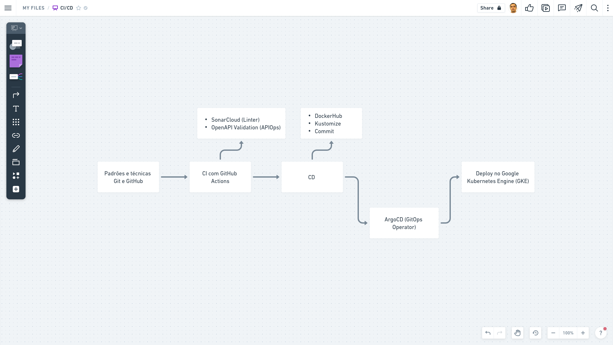

### Utilização da metodologia de GitFlow

- Qual é o problema que o _GitFlow_ resolve?

Na verdade, o _GitFlow_ é uma metodologia de trabalho que visa simplificar e organizar o processo que envolve o versionamento de código-fonte. Portanto, ele resolve um conjunto de problemas, como, por exemplo:

- Como definir um _branch_ para uma correção?
- Como definir um _branch_ para uma funcionalidade nova?
- Como saber se uma funcionalidade nova ainda está em desenvolvimento ou foi concluída?
- Como saber se o que está no _branch master_ é o mesmo que está em Produção?
- Como saber se existe um _branch_ de desenvolvimento?

Vejamos, então, dois cenários deste projeto aonde será empregado o _GitFlow_.

#### Cenário I

Neste cenário, há a definição de um _branch master_, também conhecido como _o branch da verdade_, porque, normalmente, o que está no _master_ equivale ao que está em Produção.

O _GitFlow_ recomenda que não se aplique um _commit_ diretamente no _branch master_. O _master_ não deve ser um local onde se consolidam todas as novas funcionalidades.

Então, o _GitFlow_ define um _branch_ auxiliar para que, quando todas as funcionalidades novas forem agregadas no branch auxiliar, aí sim elas são jogadas para o branch master. Esse branch auxiliar é chamado de _develop_.

O _GitFlow_ define também um branch chamado de _feature_ para desenvolver cada nova funcionalidade. Quando o desenvolvimento finaliza, é feito um merge no _branch develop_. Ou seja, ao finalizar, é tudo jogado para o branch develop. Frisando que nunca deve-se mergear diretamente uma funcionalidade nova com o _branch master_.

Sumarizando, o _GitFlow_ define um _branch_ para _feature_, _develop_ e _master_.

#### Cenário II

Neste cenário, há a definição do _branch release_. Ou seja, antes de colocar qualquer coisa no _branch master_, é necessário criar, antes, um _branch_ de _release_.

E, a partir desse _branch_ de _release_, é gerada uma _tag_ e, depois, faz-se o _merge_ no _branch master_.

Dessa forma, no dia-a-dia, tudo o que for sendo consolidado é jogado no _branch develop_. Porém, ao concluir uma _sprint_, por exemplo, pode-se separar as novas funcionalidades e colocá-las em um _branch de release_.

Uma vez que haja uma _release_, pode-se solicitar ao pessoal de _QA_, por exemplo, verificar se não há mais nada para corrigir.

Estando tudo correto, pode-se fazer o merge. E, a partir do _merge_, é gerada uma _tag_, que é enviada para o _branch master_.

### Definição de um nova Organização no GitHub

Antes de realizarmos o nosso primeiro _commit_ no _GitHub_, é necessário atentar que, para trabalhar no _GitHub_ de forma colaborativa, ou seja, aonde haja a participação de outros colaboradores nos repositórios, é necessário criar uma organização onde os colaboradores possam ser vinculados.

Nesse sentido, criamos uma organização fictícia, a _maratonafullcyclesidartaoss_ e vinculamos 3 usuários do GitHub a essa organização, conforme a definição abaixo:

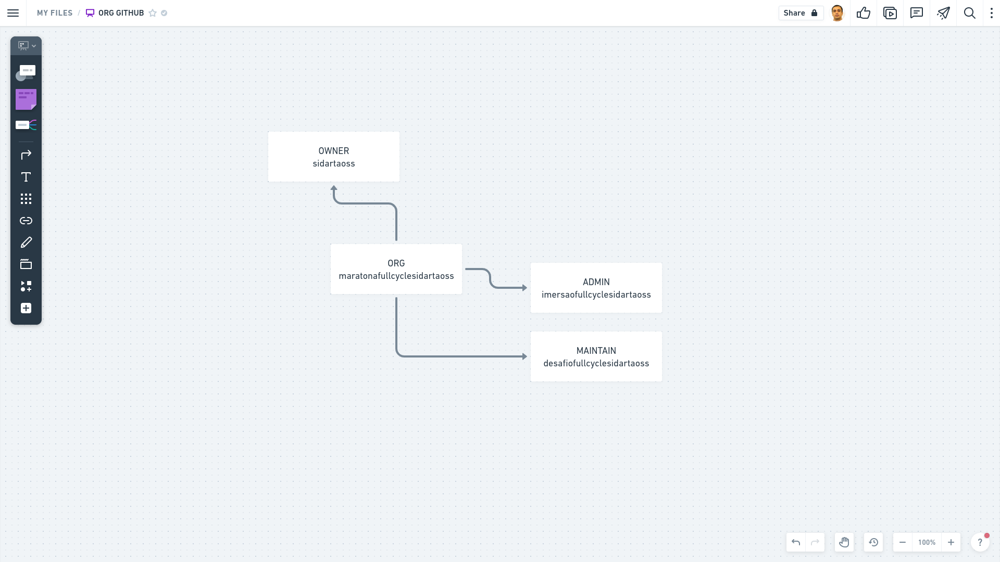

Logo, para o _commit_ da aplicação _Driver_:

1. Criamos um novo repositório público na organização _maratonafullcyclesidartaoss_: o _fullcycle-maratona-1-codelivery-part-5-driver_.

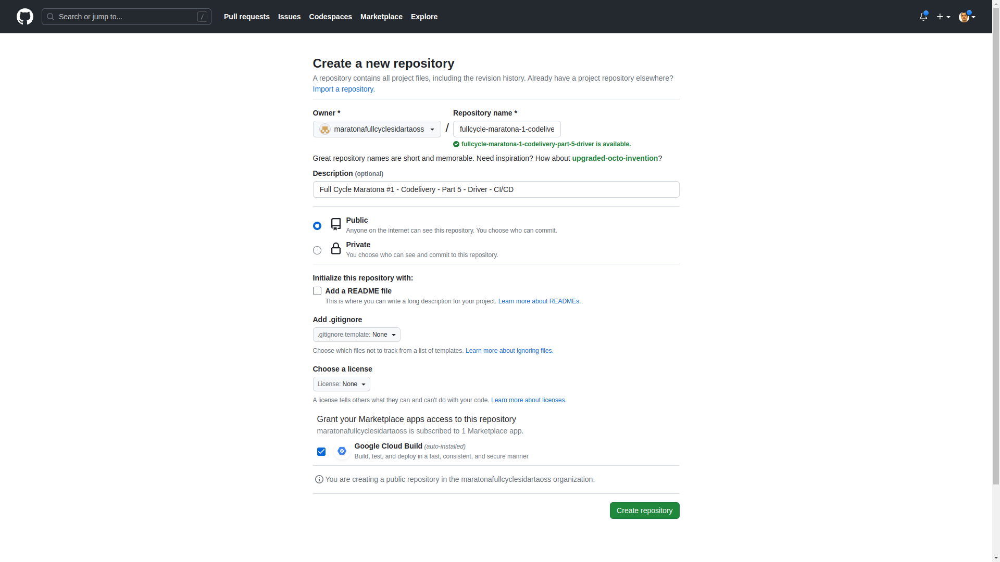

2. E para dar o _push_ inicial da aplicação no _GitHub_:

```
git init

git add .

git commit -m "feat: add driver"

git remote add origin https://github.com/maratonafullcyclesidartaoss/fullcycle-maratona-1-codelivery-part-5-driver.git

git push -u origin master
```

### Configuração de branches no GitHub

São consideradas boas práticas, que proporcionam mais segurança e tranqüilidade ao trabalhar-se com repositórios no _GitHub_:

- Nunca comitar diretamente no _branch master_;
- Nunca comitar diretamente no _branch develop_;
- Sempre trabalhar com _Pull Requests_.

Sendo assim, a seguir, são feitas algumas configurações básicas para a proteção dos _branches_.

### Protegendo branches

A princípio, por padrão, um repositório é criado apenas com um _branch_: o _branch master_. Então, criaremos o _branch develop_ na seqüência:

```
git checkout -b develop

git push origin develop
```

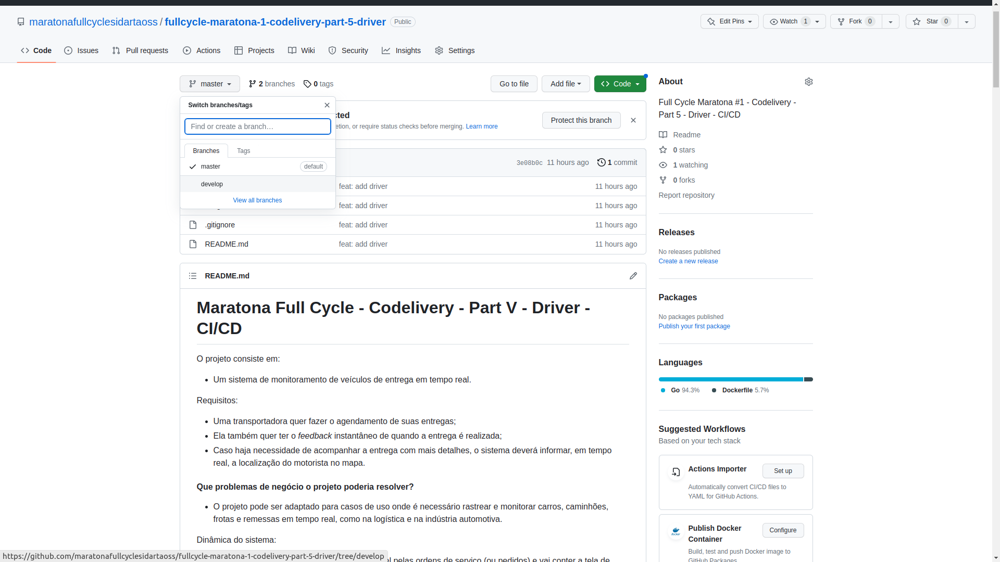

Dessa forma, o _branch master_ não será mais o _branch_ padrão. Ele será um _branch_ que utilizaremos como base para verificar se o que está nele equivale ao que está em Produção. E o _branch_ padrão que utizaremos para comitar, conforme o processo de _GitFlow_, será o _develop_.

Neste momento, então, nós vamos nas configurações do _GitHub_, em _Settings_ / _Default branch_ e alteramos de _master_ para _develop_, para garantir que os _commits_ não serão feitos diretamente para o _branch master_.

Outra configuração importante refere-se à parte de proteção. Para isso, ao acessar _Settings / Branches / Branch protection rules_, é possível adicionar regras de proteção para os _branches_.

Primeiramente, faremos a proteção do _branch master_. Neste momento, nós iremos restringir o _push_ para alguns grupos ou pessoas, ao marcar a opção _Restrict who can push to matching branches_. Por ora, é isso: clicamos em _Create_.

Em seguida, fazemos a proteção do _branch develop_, da mesma forma que fizemos com o _branch master_.

Após configurar uma proteção mínima para os _branches_, vamos adicionar os colaboradores do repositório. Para isso, vamos em _Settings / Collaborators and teams / Manage access_ e clicamos em _Add people_. Adicionamos os usuários _sidartaoss_ e _imersaofullcyclesidartaoss_ no papel de _Admin_ e _desafiofullcyclesidartaoss_ no papel de _Maintain_.

### Pull Requests

Primeiramente, nós criamos um novo _branch_ para uma nova funcionalidade:

```
git checkout -b feature/update-readme
```

Vamos alterar o arquivo _README.md_ e adicionar um arquivo no diretório _images_. Então, damos um _commit_ e um _push_ para subir no _GitHub_:

```
git add .

git commit -m "docs: update readme.md"

git push origin feature/update-readme
```

O repositório no GitHub verifica que um novo _branch_ chamado feature/update-readme subiu e já oferece a opção de comparar esse _branch_ com os demais _branches_ do repositório e já realizar uma _Pull Request_.

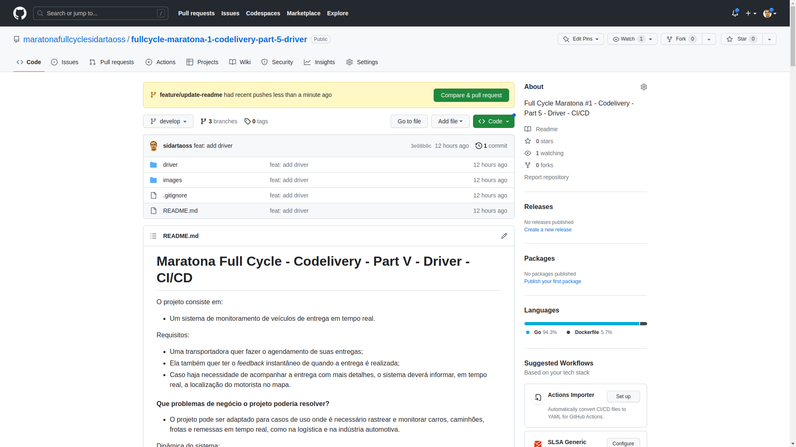

Ao clicar em _Compare & pull request_, o GitHub mostra a opção de solicitar uma _Pull Request_ (_PR_) para o branch _develop_. Todas às vezes em que é criado um _PR_, é necessário detalhar sobre o que se trata o _PR_ na parte de comentários. Então, após deixar um comentário, clica-se em _Create pull request_.

A partir deste momento, caso não haja nenhum conflito impedindo, é possível realizar o _merge_ para _develop_. Então, é só clicar em _Merge pull request_ e _Confirm merge_.

O _GitHub_ aproveita para sugerir que deletemos o branch _feature/update-readme_, uma vez que já foi mergeado. Após deletar o _branch_ no _GitHub_, é necessário, também, deletar na máquina local:

```
git checkout develop

git pull origin develop

git branch

git branch -d feature/update-readme

git branch
```

### Criando Template para PRs

Toda vez em que é criado um _PR_, é possível adicionar um detalhamento na parte de comentários para esse _PR_.

No entanto, esse detalhamento pode deixar muito a desejar, porque pode ficar em um escopo muito aberto.

Por conta disso, é possível trabalhar com a utilização de _templates_ para _PRs_. Então, toda vez que for criado um novo _PR_, um _template_ pré-montado é apresentado à pessoa que esteja criando o _PR_ para que ela possa seguir algumas diretrizes.

Nesse sentido, vamos utilizar um _template_ baseado em um modelo disponível no _site_ _[Embedded Artistry](https://embeddedartistry.com/blog/2017/08/04/a-github-pull-request-template-for-your-projects)_.

A partir desse modelo, nós vamos criar um arquivo chamado _PULL_REQUEST_TEMPLATE.md_ dentro do diretório _.github_.

O _checklist_ de opções vai depender de cada projeto e das necessidades de cada equipe, mas, o mais importante é ter o modelo de _template_; a partir dele, é possível adaptar o _checklist_ às demandas de cada time.

Então, criamos o _template_ a partir de uma nova funcionalidade:

```
git checkout -b feature/pull-request-template

```

Criamos um diretório chamado _.github_ e, dentro desse diretório, o arquivo _PULL_REQUEST_TEMPLATE_.md\_.

```
mkdir .github

touch .github/PULL_REQUEST_TEMPLATE.md
```

Colamos nesse arquivo o conteúdo do _site_ _Embedded Artistry_. Em seguida, comitamos e subimos para o _GitHub_.

```
git add .

git commit -m "chore: add pull request template"

git push origin feature/pull-request-template
```

De volta ao _GitHub_, o template não vai funcionar ainda, porque é necessário subir primeiramente para _develop_ através do _PR_ que está sendo criado neste momento. Mas, para os próximos _PRs_, o _template_ já estará sendo aplicado.

Apenas para testar se tudo está funcionando, vamos criar uma nova funcionalidade para, por exemplo, criar um arquivo de manifesto no diretório _k8s/_:

```
git checkout -b feature/k8s-driver

mkdir k8s

touch k8s/driver.yaml
```

Em seguida, comitamos e subimos para o _GitHub_:

```
git add .

git commit -m "chore: add k8s manifesto to driver"

git push origin feature/k8s-driver
```

Conforme esperado, ao acessar o repositório no _GitHub_, está sendo exibido o _template_ ao criar um novo _PR_.

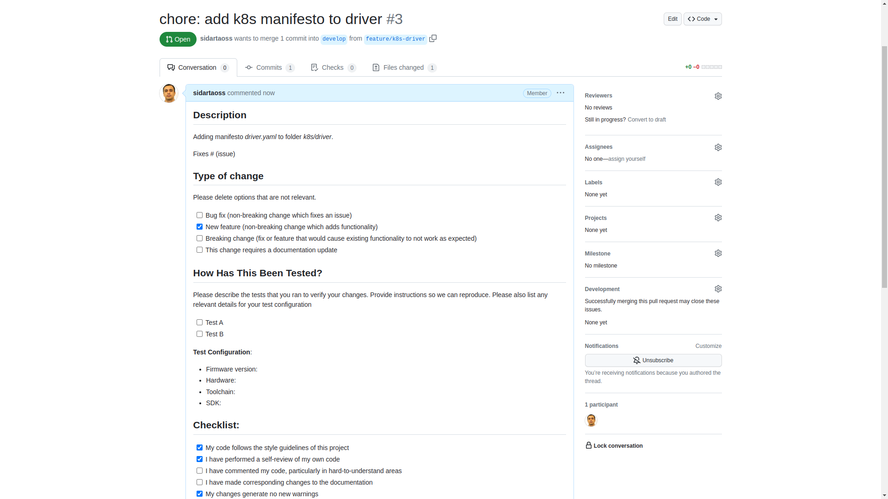

### Code Review

É extremamente importante ter, quando se está trabalhando em equipe, um ou mais colegas revisando o seu código. Por quê? Porque, quando se está trabalhando em equipe, todos são responsáveis pela entrega do projeto. Então, quando algúem envia um código para revisão, a pessoa que está revisando também é responsável por aquele código.

Para ver o processo de _code review_ no _GitHub_, nós vamos trabalhar com o usuário _desafiofullcyclesidartaoss_ criando um novo _PR_. Esse _PR_ deve ser revisado, posteriormente, pelo usuário _sidartaoss_.

Primeiramente, o usuário _sidartaoss_ criará um _branch_ para uma nova funcionalidade e subirá para o _GitHub_:

```
git checkoub -b feature/k8s-driver-deployment

git push origin feature/k8s-driver-deployment
```

Então, no _GitHub_, o usuário _desafiofullcyclesidartaoss_ vai acessar o _branch_ _feature/k8s-driver-deployment_.

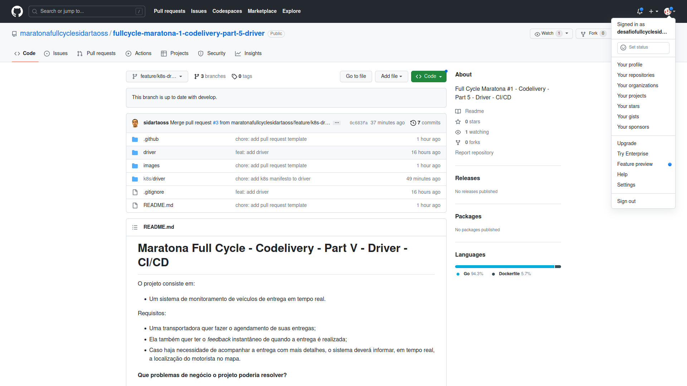

Na seqüência, o usuário _desafiofullcyclesidartaoss_ edita o arquivo _k8s/driver.yaml_ com suas alterações e comita.

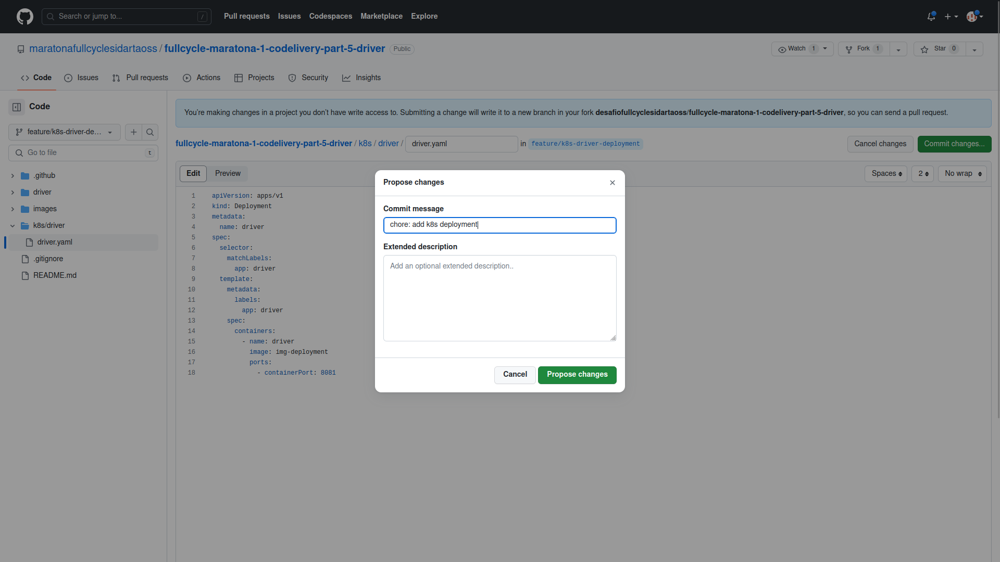

Antes de criar o _PR_, o usuário _desafiofullcyclesidartaoss_ vai poder selecionar um revisor para realizar o _code review_ do seu código. Neste caso, será selecionado o usuário _sidartaoss_ como revisor (_Reviewer_).

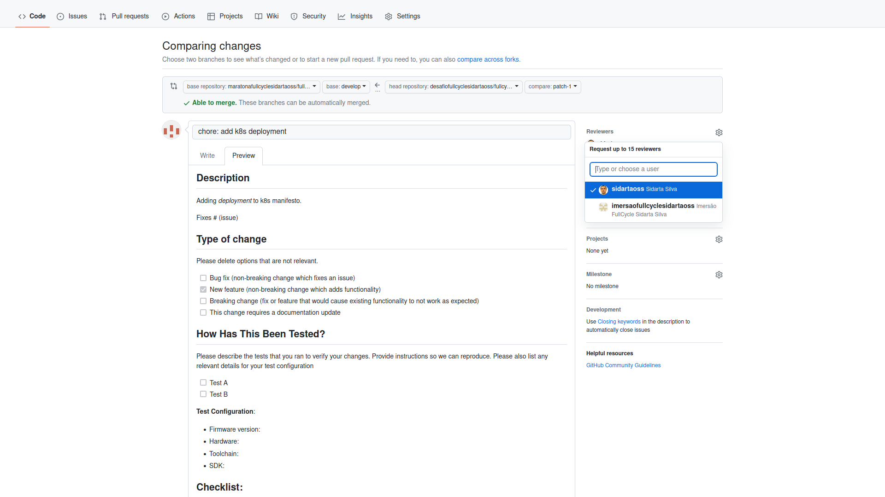

Após criar o _PR_, o usuário _sidartaoss_ vai perceber, então, que, na aba _Pull requests_, há um _PR_ aguardando revisão. Ao acessá-la, surge, na tela, uma mensagem para adicionar uma nova revisão.

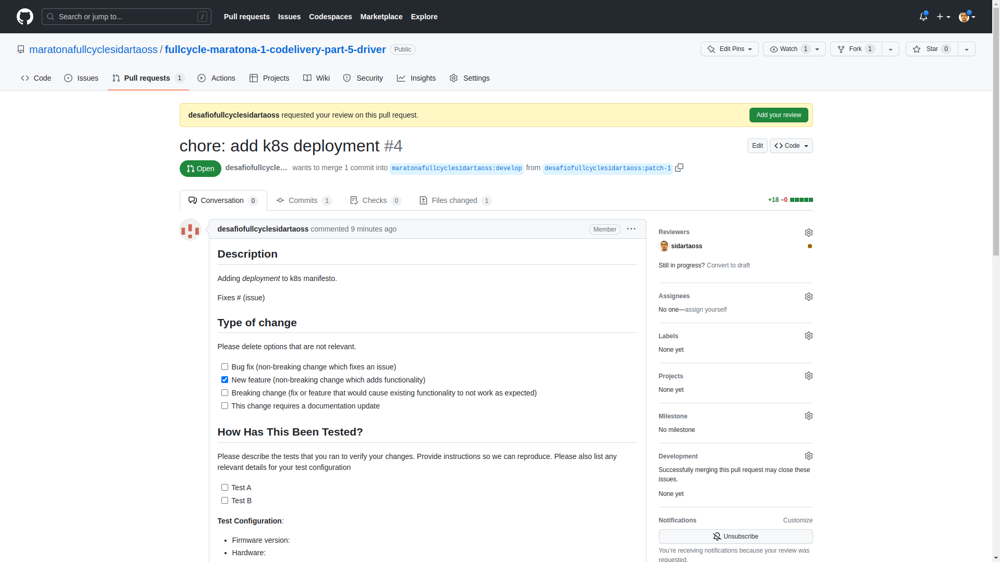

Ao clicar em _Add your review_, caso seja necessário solicitar alguma alteração no código, o revisor (usuário _sidartaoss_) vai adicionar um comentário, clicar em _Start a review_ / _Review chages_, escolher a opção _Request changes_ e clicar em _Submit review_.

Então, o usuário _desafiofullcyclesidartaoss_ acessa a aba _Files changed_, clica em _Edit file_ e efetua a correção solicitada. Ao finalizar, comita as mudanças no mesmo _branch_ em que foi criado o _PR_. Assim, o _branch_ e o _PR_ são atualizados automaticamente.

Depois disso, o usuário _desafiofullcyclesidartaoss_ acessa o _PR_ novamente e, abaixo, na seção _Changes requested_, navega até _requested changes_ e escolhe a opção _Re-request review_.

A partir desse momento, ao acessar o _PR_, o revisor adiciona uma revisão novamente e verifica a(s) mudança(s). Então, se estiver tudo conforme o esperado, ele vai clicar no botão _Review changes_, escolher a opção _Approve_ e clicar em _Submit review_, habilitando, assim, o _merge_, a confirmação do _merge_ e a deleção do _branch_ _feature/k8s-driver-deployment_.

Mas, caso não haja necessidade de solicitar mudanças, o revisor simplesmente clica em _Review changes_, escolhe a opção _Approve_ e clica novamente em _Submit review_, habilitando, então, o _merge_, a confirmação do _merge_ e a deleção do _branch_ _feature/k8s-driver-deployment_.

### Protegendo branch para Code Review

É possível melhorar a proteção dos _branches_ para se trabalhar com _PRs_.

Vejamos um exemplo. O usuário _sidartaoss_ cria o _branch_ de uma nova funcionalidade e sobe para o _GitHub_:

```
git checkout -b feature/k8s-service

git push origin feature/k8s-service
```

Então, o usuário _desafiofullcyclesidartaoss_ acessa o _branch_ recém criado, adiciona uma alteração no arquivo _k8s/driver.yaml_, comita a alteração, escolhe um revisor e, finalmente, cria um novo _PR_.

E, mesmo tendo solicitado a revisão, pode-se verificar que o botão _Merge pull request_ permanece habilitado para efetuar o _merge_.

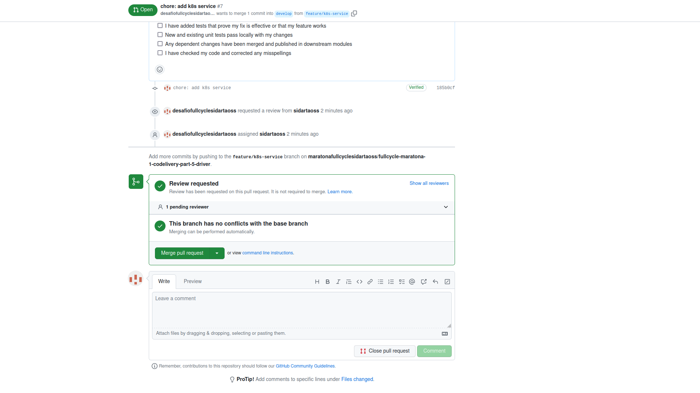

Então, como proteger o _branch_ _develop_ para que isso não aconteça?

Acessando _Settings / Branches / Branch protection rules_ e selecionando o _branch_ _develop_, é possível obrigar para que haja _code review_ para toda _PR_ antes de ser possível efetuar o _merge_. Para isso, deve-se selecionar a opção _Require a pull request before merging_. A partir dessa opção, é possível escolher também quantas pessoas devem revisar o código; neste caso, apenas uma.

Ao clicar em _Save changes_ e voltar na _PR_, percebemos que, tanto o usuário _sidartaoss_ quanto o usuário _desafiofullcyclesidartaoss_ ficam bloqueados para efetuar o _merge_ enquanto não for realizado o _code review_:

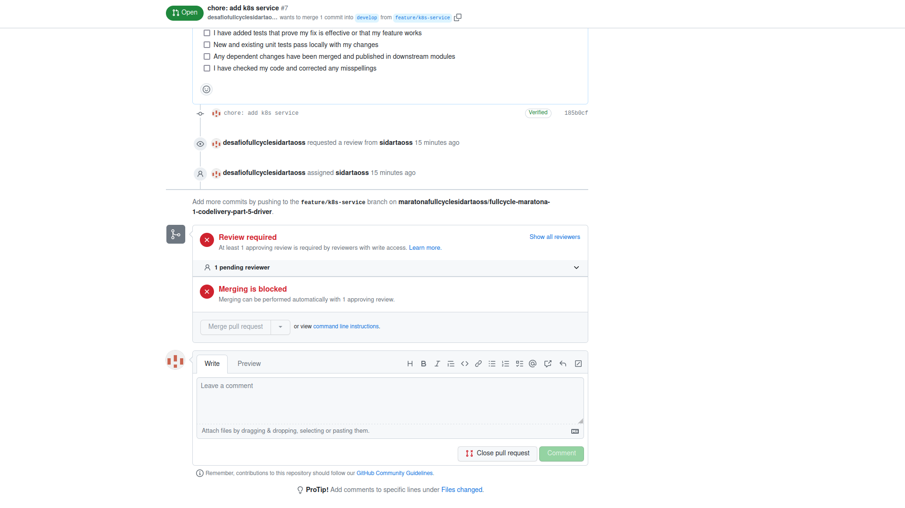

Assim, quando é feito, pelo menos, uma revisão por um usuário revisor, é liberado o _merge_ para o _branch develop_. Isso garante, então, que um _PR_ só será mergeado após uma ou mais revisões.

### Trabalhando com CODEOWNERS

Imaginemos o seguinte cenário:

- O usuário _desafiofullcyclesidartaoss_ é um especialista _frontend_ e o usuário _sidartaoss_ é um especialista _backend_. Em determinado momento, por algum motivo, o usuário _desafiofullcyclesidartaoss_ precisou alterar o código que foi criado pelo usuário _sidartaoss_. Não seria apropriado o usuário _sidartaoss_ revisar o _PR_ desse código, já que ele é especialista nesse tipo de código e foi ele quem o criou?

É por conta disso que existe um recurso extremamente útil e que facilita o processo de _code review_ chamado de _CODEOWNERS_, onde é possível definir quem é o dono de certos tipos de códigos. Essa definição pode-se dar a partir de um diretório, uma extensão de arquivos ou até mesmo de um arquivo em específico.

Então, a partir do momento que se atribui a propriedade de um tipo de código para alguém, aquela pessoa será responsável, automaticamente, por revisar aquele tipo de código.

Assim, nós vamos criar um novo _branch_ para criar essa nova funcionalidade:

```
git checkout -b feature/codeowners

touch .github/CODEOWNERS
```

Dentro desse arquivo de _CODEOWNERS_, nós vamos inserir o seguinte:

```
*.js @desafiofullcyclesidartaoss
.github/ @imersaofullcyclesidartaoss
*.go @sidartaoss
*.html @desafiofullcyclesidartaoss
```

Dessa forma, o usuário _desafiofullcyclesidartaoss_ será o proprietário de todos os arquivos com extensão _\*.js_ e _\*.html_. O usuário _imersaofullcyclesidartaoss_ será o proprietário do diretório _.github/_ e o usuário _sidartaoss_ será o proprietário de todos os arquivos com extensão _\*.go_.

Após subir essa nova funcionalidade para o _GitHub_, nós vamos setar mais uma configuração. Para isso, nós vamos em _Settings / Branches_, selecionar o _branch develop_ para edição e marcar a opção _Require review from Code Owners_. Isso vai habilitar a exigência de que um _code owner_ deve revisar o código.

Para testar esse recurso, nós vamos criar um novo _branch_ para uma nova funcionalidade:

```
git checkout -b feature/refactor-folders

mv .github/ driver/

mv k8s/ driver/

git status

git add .

git commit -m "refactor: move .github and k8s into driver folder"

git push origin feature/refactor-folders
```

Note-se que, ao criar o _PR_, automaticamente, aparece o usuário _imersaofullcyclesidartaoss_ como _code owner_ para fazer a revisão do código, porque estamos mexendo no diretório _.github_, ao qual ele é o proprietário:

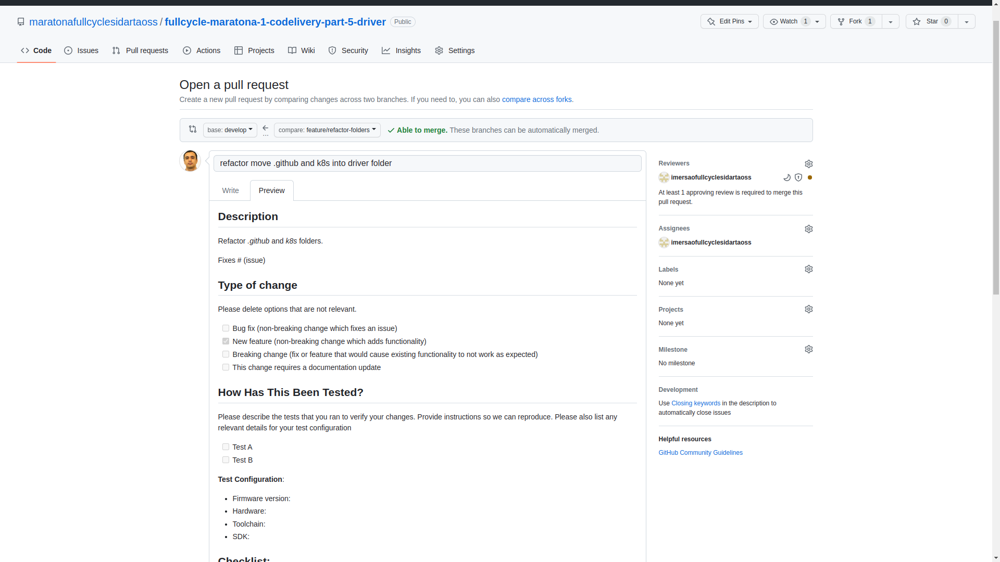

### Continuous Integration

Esses são alguns dos principais subprocessos envolvidos na execução do processo de _CI_ e que são cobertos neste projeto:

- Execução de testes;
- _Linter_;
- Verificação de qualidade de código;
- Verificação de segurança;
- Geração de artefatos prontos para o processo de _deploy_.

Algumas das ferramentas populares para a geração do processo de Integração Contínua:

- _Jenkins_;
- _GitHub_ _Actions_;
- _AWS CodeBuild_;
- _Azure DevOps_;
- _Google Cloud Build_;
- _GitLab CI/CD_.

#### GitHub Actions

A ferramenta escolhida para este projeto é o _GitHub_ _Actions_. Principalmente porque:

- É livre de cobrança (para repositórios públicos);
- É totalmente integrada ao _GitHub_.

Estar integrado ao _GitHub_ pode ser considerado um diferencial, porque, baseado em eventos que acontecem no repositório, vários tipos de ações (_Actions_) - além das relacionadas ao processo de _CI_ - podem ser executadas.

Sempre se inicia uma _GitHub Action_ a partir de um _workflow_.

#### Workflow

O _workflow_ consiste em um conjunto de processos definidos pelo desenvolvedor, sendo que é possível ter mais de um _workflow_ por repositório.

Um _workflow_:

- É definido em arquivos _.yaml_ no diretório _.github/workflows_;
- Possui um ou mais _jobs_ (que o _workflow_ roda);
- É iniciado a partir de _eventos_ do _GitHub_ ou através de agendamento.

#### Eventos

Para cada evento, é possível definir _filtros_, _ambiente_ e _ações_.

Exemplo:

- **Evento**:
  - _on: push_
- Filtros:
  - _branches_:
    _master_
- Ambiente:
  - _runs-on: ubuntu_
- Ações:
  - _steps_:
    - _uses: action/run-composer_
    - _run: npm run prod_

Nesse exemplo:

- É disparado um _evento_ de _on_ _push_, no momento em que alguém executou um _push_ no repositório;
- O _ambiente_ define a máquina em que o processo de _CI_ deve rodar; nesse caso, em uma máquina _ubuntu_;
- O _filtro_ define que o evento deve acontecer somente quando for executado um _push_ para o _branch master_;
- As _ações_ definem passos (_steps_), subdivididos em duas opções:
  - _uses_ define uma _Action_ do _GitHub_, ou seja, um código desenvolvido por um desenvolvedor para ser executado no padrão do _GitHub Actions_. Inclusive, há um _marketplace_ do _GitHub Actions_ (`https://github.com/marketplace`);
  - _run_ permite executar uma _Action_ ou um comando; nesse caso, é executado um comando dentro da máquina _ubuntu_.

### Criando primeiro workflow

Neste momento, vamos criar o nosso primeiro _workflow_ utilizando o _GitHub Actions_.

Primeiramente, vamos criar um novo _branch_ para uma nova funcionalidade e, em seguida, criamos um novo diretório _.github/workflows_ e um arquivo _ci.yaml_.

```
git checkout -b feature/primeiro-workflow

mkdir .github/workflows

touch .github/workflows/ci.yaml
```

Dentro desse arquivo _ci.yaml_, faremos a definição do _workflow_.

O _name_ do _workflow_ pode ser qualquer nome. Neste caso, chamamos de _ci-driver_.

```
name: ci-driver
```

No evento de _on push_, ou seja, toda vez que alguém fizer um _push_ diretamente para esse repositório, esse processo de _CI_ vai rodar.

```
name: ci-driver
on: [push]
```

Na seqüência, nós definimos quais são os _jobs_ que queremos executar. O primeiro _job_ que vamos trabalhar será o _check-application_:

```
name: ci-driver
on: [push]
jobs:
  check-application:
```

Depois, definimos aonde queremos rodar essa aplicação. Neste caso, será em uma imagem da última versão do _ubuntu_.

```
name: ci-driver
on: [push]
jobs:
  check-application:
    runs-on: ubuntu-latest
```

Após isso, definimos quais são os passos que queremos executar no momento em que esse processo começar a ser executado. O primeiro _step_ é o _actions/checkout@v3_.

> Lembrando que _actions_ refere-se ao usuário e _checkout_ refere-se ao repositório do _GitHub_: `https://github.com/actions/checkout`.

O que o _actions/checkout@v3_ faz é pegar os arquivos do repositório do _GitHub_ e baixar na máquina _ubuntu_.

```
name: ci-driver
on: [push]
jobs:
  check-application:
    runs-on: ubuntu-latest
    steps:
      - uses: actions/checkout@v3
```

Outra _action_ que vamos utilizar é a _actions/setup-go@v4_, responsável por preparar o ambiente _go_.

```
name: ci-driver
on: [push]
jobs:
  check-application:
    runs-on: ubuntu-latest
    steps:
      - uses: actions/checkout@v3
      - uses: actions/setup-go@v4
```

Após preparar o ambiente, é possível escolher a versão do _go_ que queremos utilizar.

```
name: ci-driver
on: [push]
jobs:
  check-application:
    runs-on: ubuntu-latest
    steps:
      - uses: actions/checkout@v3
      - uses: actions/setup-go@v4
        with:
          go-version: '>=1.18'
```

E, por fim, vamos rodar um comando para testar e para fazer o _build_ da aplicação.

```
name: ci-driver
on: [push]
jobs:
  check-application:
    runs-on: ubuntu-latest
    steps:
      - uses: actions/checkout@v3
      - uses: actions/setup-go@v4
        with:
          go-version: '>=1.18'
      - run: go test ./...
      - run: go build driver.go
```

Porém, antes de comitar as alterações, vamos criar uma classe de testes: _driver_test.go_

```
touch driver_test.go

vim driver_test.go

package main

import "testing"

func TestLoadDrivers(t *testing.T) {
	// arrange
	// act
	actual := loadDrivers()
	// assert
	if actual == nil {
		t.Error("Expected drivers but got nil")
	}
}

```

E, neste momento, vamos subir para o _GitHub_:

```
git add .

git commit -m "ci: add github actions"

git push origin feature/primeiro-workflow
```

Ao acessar na aba _Actions_, verificamos que o _workflow_ _ci-driver_ rodou com sucesso.

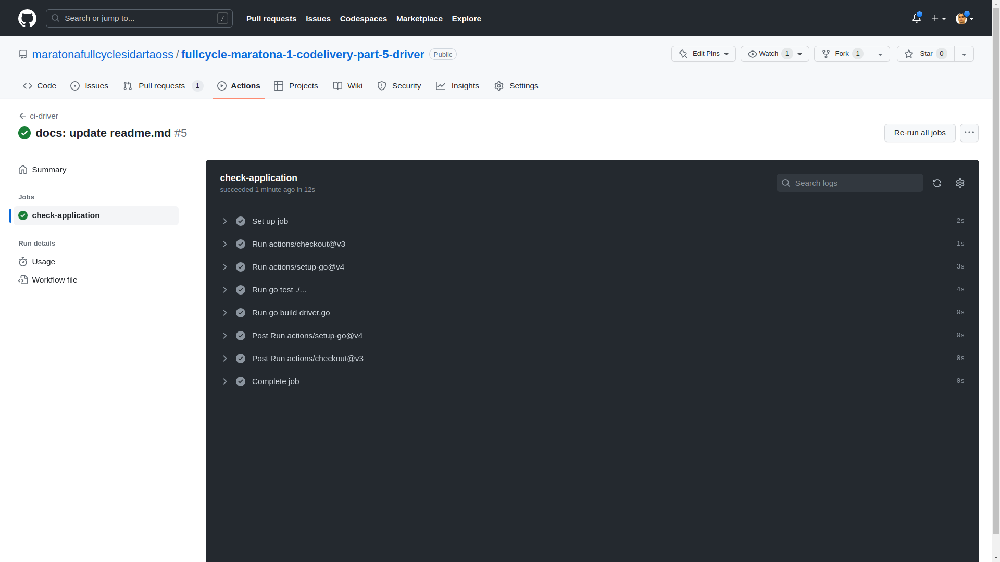

Na parte inferior do _PR_, é possível ver, também, que todas as verificações passaram (_All checks have passed_):

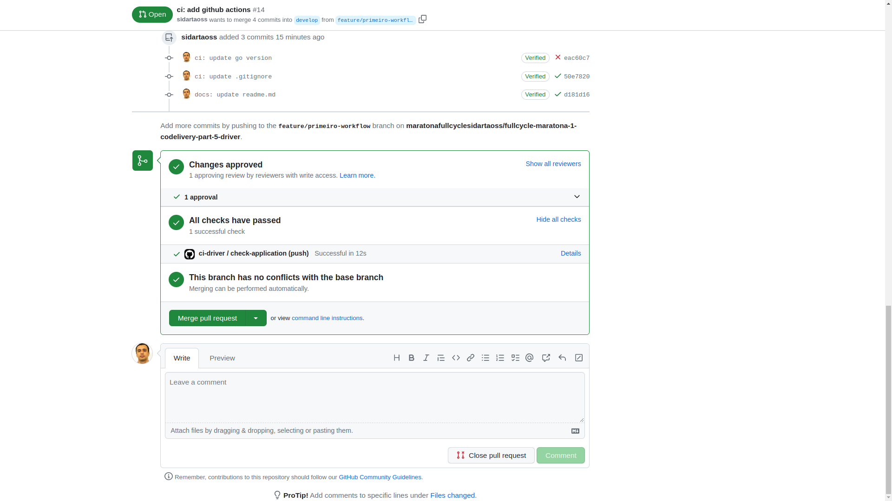

### Ativando status check

Voltando às boas práticas de proteção dos _branches_, vamos adicionar mais uma regra de proteção para o _branch develop_: nós vamos exigir que um _status check_ passe antes de realizar o _merge_: _Require status checks to pass before merging_.

Neste caso, nós vamos informar, como _status check_, o _check-application_. O _check-application_ refere-se ao _job_ que nós configuramos no arquivo _ci.yaml_.

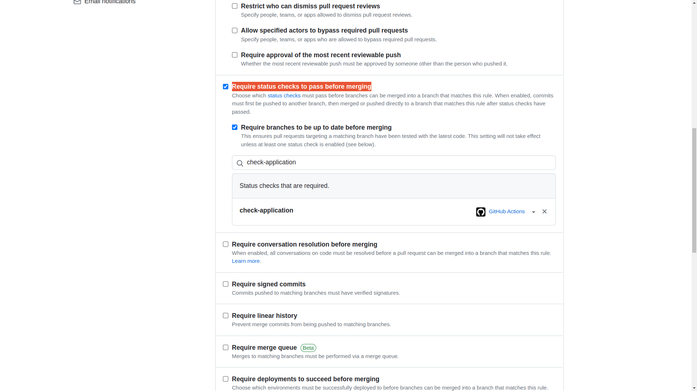

E, da mesma forma que configuramos para o _branch_ _develop_, configuramos para o _branch master_.

#### Separando os processos

O processo de _CI_, que vai rodar para o _branch_ _develop_, vai ser diferente do processo de _CD_, que vai rodar para o _branch_ _master_.

Normalmente, o processo de _CI_ só vai verificar se está tudo passando, enquanto que o processo de _CD_, além de fazer essa verificação, vai, também, fazer o _deploy_.

Nesse sentido, nós vamos adicionar uma restrição no nosso _workflow_ para que o processo de _CI_ aconteça apenas para o _branch develop_, porque as regras para o ambiente de Produção vão ser diferentes.

```
name: ci-driver
on:
  pull_request:
    branches:
      - develop
jobs:
  check-application:
    runs-on: ubuntu-latest
    steps:
      - uses: actions/checkout@v3
      - uses: actions/setup-go@v4
        with:
          go-version: ">=1.18"
      - run: go test ./...
      - run: go build driver.go
```

### Preparando ambiente para o SonarCloud

O nosso objetivo, neste momento, é integrar um serviço gerenciado do _Sonarqube_ - o _SonarCloud_ - ao processo de Integração Contínua.

Basicamente, o que iremos fazer é integrar ao _GitHub Actions_ o _quality gate_ do _SonarCloud_.

Então, inicialmente, vamos criar um novo _branch_ para adicionar essa nova funcionalidade:

```
git checkout -b feature/sonar-cloud
```

A primeira alteração que faremos no nosso _workflow_ é para permitir trabalharmos com cobertura de código a partir do _SonarCloud_.

Para isso, vamos alterar o comando de teste do _go_ para inserir o resultado dos testes em um arquivo chamado _coverage.out_:

```
name: ci-driver
on:
  pull_request:
    branches:
      - develop
jobs:
  check-application:
    runs-on: ubuntu-latest
    steps:
      - uses: actions/checkout@v3
      - uses: actions/setup-go@v4
        with:
          go-version: ">=1.18"
      - run: go test -coverprofile=coverage.out
```

Em seguida, vamos adicionar um arquivo de configuração à raiz do projeto: _sonar-project.properties_:

```
touch sonar-project.properties

vim sonar-project.properties

sonar.projectKey=
sonar.organization=

sonar.sources=.
sonar.exclusions=**/*_test.go

sonar.tests=.
sonar.test.inclusions=**/*_test.go
sonar.go.coverage.reportPaths=coverage.out
```

- A propriedade _sonar.sources_ define aonde está o código-fonte.
- A propriedade _sonar.exclusions_ define quais arquivos devem ser excluídos da cobertura de código.
- A propriedade _sonar.tests_ define aonde estão os arquivos de testes.
- A propriedade _sonar.test.inclusions_ define quais são os arquivos de testes.
- A propriedade _sonar.go.coverage.reportPaths_ define qual é o arquivo de _coverage_.

E vamos subir essas alterações para o _GitHub_.

```
git add .

git commit -m "ci: add sonar cloud"

git push origin feature/sonar-cloud
```

### SonarCloud

> Lembrando que o _SonarCloud_ é uma ferramenta paga, mas, para repositórios públicos, ele é gratuito.

- Ao acessar `https://sonarcloud.io`, realiza-se o login pela conta do _GitHub_.
- No menu superior, deve-se ir em _Analize new project_.
- Em seguida, seleciona-se a organização, que, neste caso, é _maratonafullcyclesidartaoss_ e o repositório que, neste caso, é _
  fullcycle-maratona-1-codelivery-part-5-driver_. Por fim, clicar em _Set Up_.
- Em _Choose your Analisys Method_, deve-se selecionar _With GitHub Actions_.
- Na tela seguinte, _Analyze a project with a GitHub Action_, o _SonarCloud_ informa que será necessário criar um novo _secret_ chamado _SONAR_TOKEN_ no repositório do _GitHub_.
- Na parte inferior da tela _Analyze a project with a GitHub Action_, o _SonarCloud_ pergunta qual é a linguagem de programação do projeto. Ao selecionar _Other_, ele apresenta um _template_ para executar o _Scan_ do _SonarCloud_, ao qual adicionamos em _ci.yaml_:

```
name: ci-driver
on:
  pull_request:
    branches:
      - develop
jobs:
  check-application:
    runs-on: ubuntu-latest
    steps:
      - uses: actions/checkout@v3
      - uses: actions/setup-go@v4
        with:
          go-version: ">=1.18"
      - run: go test -coverprofile=coverage.out

      - name: SonarCloud Scan
        uses: SonarSource/sonarcloud-github-action@master
        env:
          GITHUB_TOKEN: ${{ secrets.GITHUB_TOKEN }} # Needed to get PR information, if any
          SONAR_TOKEN: ${{ secrets.SONAR_TOKEN }}

```

E o _SonarCloud_ apresenta também as propriedades a serem adicionadas no arquivo _sonar-project.properties_:

```
sonar.projectKey=maratonafullcyclesidartaoss_fullcycle-maratona-1-codelivery-part-5-driver
sonar.organization=maratonafullcyclesidartaoss
```

Com isso, podemos subir as alterações para o _GitHub_.

```
git add .

git commit -m "ci: add sonar cloud properties"

git push orign feature/sonar-cloud
```

E, ao subir para o _GitHub_, percebemos que o _Quality Gate_ do _SonarCloud_ falhou:

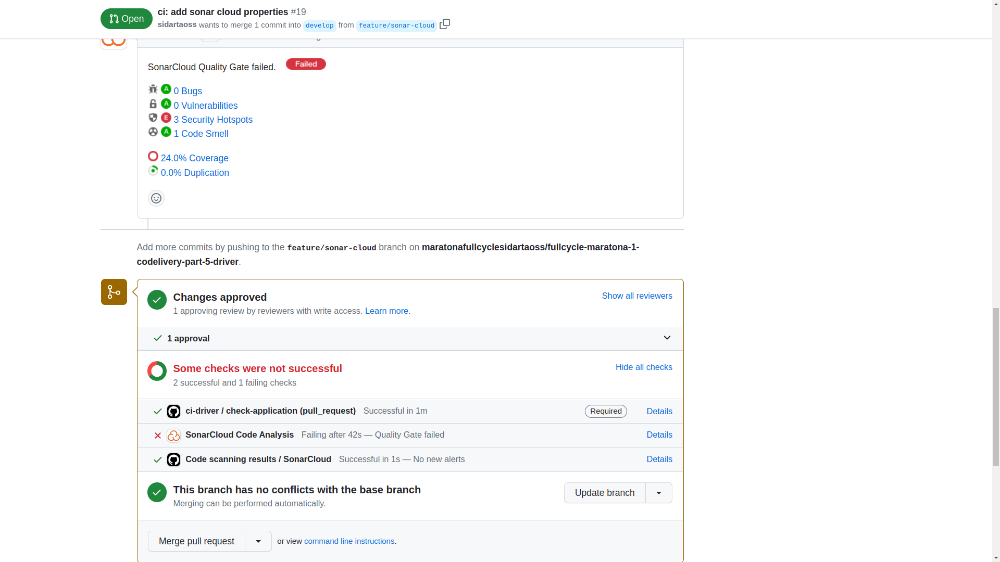

Ao clicar no link _Details_ de _SonarCloud Code Analysis_:

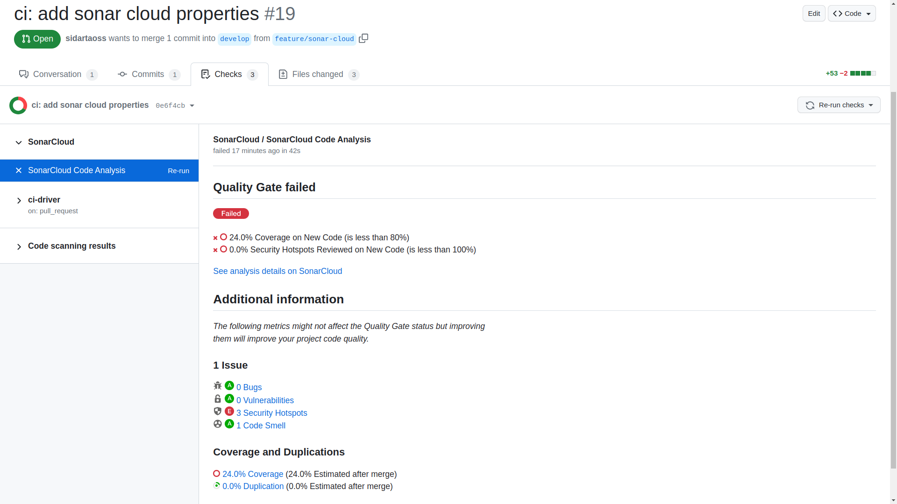

- A cobertura de código está abaixo do esperado (80%);
- Há 3 problemas de segurança;
- E há 1 _code smell_.

Em relação à cobertura de código:

- Clicamos no _link_ de _24.0% Coverage_;
- Abaixo, no menu esquerdo, vamos em _Administration / Quality Gate_ / Organization's settings e selecionamos ou criamos um novo _Quality Gate_. Neste caso, vamos selecionar _Maratona Quality Gate_;
- Na métrica de _Coverage_, vamos setar um novo valor de 20%;

Em relação aos problemas de segurança, eles foram identificados no _Dockerfile_ e no _Dockerfile.prod_:

- _Copying recursively might inadvertently add sensitive data to the container. Make sure it is safe here._
- _The golang image runs with root as the default user. Make sure it is safe here._

Em relação ao _code smell_, ele foi identificado no _Dockerfile.prod_:

- _Replace `as` with upper case format `AS`_.

Não devemos esquecer também de ir em _Settings / Branches / Branch protection rules / Edit develop_ e adicionar _SonarCloud Code Analysis_ na opção de _Require status checks to pass before merging_ e marcar a opção de _Do not allow bypassing the above settings_:

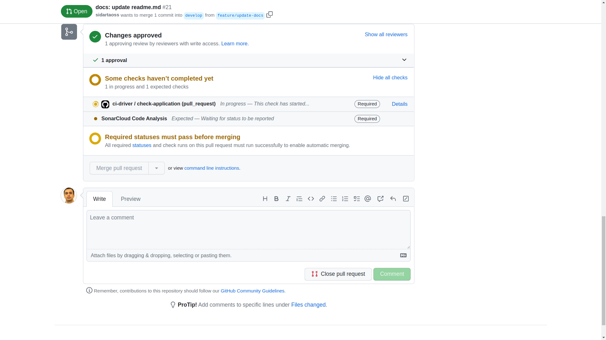

### Documentação da API

Antes de iniciarmos com a parte de _APIOps_, vamos produzir a documentação da _API_, pois a metodologia de _APIOps_ visa, também, validar informações obrigatórias na documentação da _API_.

Vamos utilizar a ferramenta _[swag](https://github.com/swaggo/swag)_ do _Go_. A partir do comando `swag init`, é gerado um diretório _docs_ contendo um arquivo _swagger.yaml_ no formato da especificação _OpenAPI_.

A geração da documentação é baseada na adição de comentários em um formato declarativo no código-fonte da _API_. Por exemplo:

```
// @contact.name   API Support
// @contact.url    http://www.swagger.io/support
// @contact.email  support@swagger.io

// @license.name  Apache 2.0
// @license.url   http://www.apache.org/licenses/LICENSE-2.0.html
func main() {
}
```

Ao aplicar as alterações sugeridas pela ferramenta, temos a versão inicial da documentação para a _API Driver_:

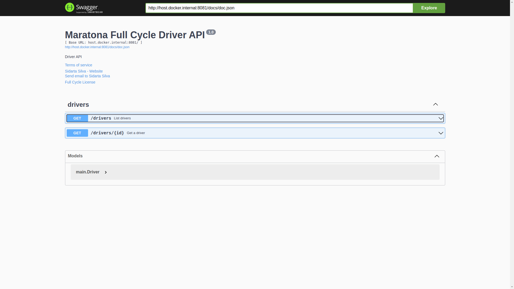

### APIOps

O nosso objetivo, agora, é automatizar o processo de validação da _API_. Para isso, vamos utilizar os princípios de _APIOps_.

Conforme documentação da _[Microsoft](https://learn.microsoft.com/pt-br/azure/architecture/example-scenario/devops/automated-api-deployments-apiops)_:

> A APIOps é uma metodologia que aplica os conceitos de GitOps e DevOps à implantação da API. Assim como o DevOps, o APIOps ajuda os membros da equipe a fazer alterações e implantá-las de maneira iterativa e automatizada.

Sendo assim, qual(is) problema(s) a _APIOps_ resolve?

Vejamos um exemplo de processo tradicional de _deployment_ de _APIs_.

No processo tradicional de _deployment_ de _APIs_, cada uma das equipes na empresa tem as suas práticas de _APIs_ e, em geral, existe um time de _APIs_ dentro da empresa. Então, as outras equipes solicitam para esse time de _APIs_ a revisão do contrato delas, ou seja, das _APIs_ que elas estão produzindo.

O time de _APIs_ vai fazer, então, a validação: verificar se o contrato está seguindo o que eles consideram como boas práticas, se há testes, etc. Se tudo estiver em conformidade com o padrão esperado, o time de _APIs_ realiza o _deployment_ para a plataforma de _APIs_.

Nesse cenário, percebe-se que alguns problemas podem acontecer:

- Conforme o número de equipes for crescendo, o time de _APIs_, obrigatoriamente, precisa ir crescendo também para não se tornar um _gargalo_ no processo, pois ele precisa validar as _APIs_ de todas as equipes da empresa.
- Além disso, o processo de validação pode ser um trabalho repetitivo e manual, o que tende a ser prejudicial para a estabilidade e a conformidade com os padrões, pois abre a possibilidade de revisões serem feitas de maneira incorreta.

Já no cenário de _deployment_ da _APIOps_, são projetadas algumas estruturas de forma automatizada, principalmente, com o objetivo de remover esse _gargalo_ no processo de revisão. A principal diferença é que o processo é automatizado, utilizando-se ferramentas para isso.

Dessa forma, é repassada ao time de _APIs_ a responsabilidade de fornecer as ferramentas e os processos para que a revisão e a entrega da _API_ em produção aconteçam de forma automatizada. Assim, no processo de _APIOps_, busca-se:

- Atender aos requisitos da empresa, no que tange à _API_, para estar em conformidade com o padrão de contrato;
- Verificar se a _API_ contém informações obrigatórias;
- Garantir que a _API_, no formato _OpenAPI_, esteja em um padrão único definido pela empresa para todas as _APIs_.

A _APIOps_ visa, por fim, aumentar a qualidade da _API_, para que seja produzida de uma maneira uniforme, aplicando um padrão de contrato, de forma que os clientes não tenham uma experiência ruim ao integrar com a _API_ que está sendo disponibilizada.

#### Ferramentas Necessárias

Vejamos o papel de algumas ferramentas na implementação dos fluxos de _APIOps_:

- GitHub Actions;
- Spectral.

#### GitHub Actions

A idéia é que o _GitHub Actions_ é capaz de prover o mecanismo para disparar um fluxo de determinadas ações que, neste caso, envolvem a validação do contrato.

Basicamente, o que iremos fazer é adicionar um novo _job_ de validação ao nosso _workflow_:

```
jobs:
  validate:
    name: Validate OpenAPI documentation
    runs-on: ubuntu-latest
    steps:
      # Check out the repository
      - uses: actions/checkout@v2

      # Run Spectral
      - uses: stoplightio/spectral-action@latest
        with:
          file_glob: "docs/swagger.yaml"
          spectral_ruleset: "docs/openapi.spectral.yaml"
```

#### Spectral

O _Spectral_ é uma ferramenta da empresa _[Spotlight](https://stoplight.io/open-source/spectral)_.

O objetivo dessa ferramenta é validar determinados arquivos como, por exemplo, o arquivo _OpenAPI_ que descreve o nosso contrato (_swagger.yaml_). Assim, o _Spectral_ é capaz de aplicar _linters_, ou seja, ele identifica algumas características que ele valida baseado em níveis de severidade.

Uma das principais vantagens em utilizar essa ferramenta é que ela já traz algumas validações prontas relacionadas a _OpenAPI_, simplificando o nosso trabalho, porque vai evitar que tenhamos que escrever mais arquivos _.yaml_.

Dessa forma, o _Spectral_ será utilizado para aplicar a validação do contrato, garantindo a conformidade do padrão para a _API_ _Driver_.

Para isso, criamos um arquivo chamado _openapi.spectral.yaml_ no diretório _docs_ que define um conjunto de regras (_Ruleset_). O arquivo que descreve a _API_ deve conter, por exemplo:

- Informações de contato;
- Nome, URL e e-mail do contato;
- Um sumário e uma descrição para cada operação de _GET, POST, PUT, DELETE, OPTIONS_.

Ao subir as alterações para o _GitHub_, verificamos que a validação da documentação _OpenAPI_ passou:

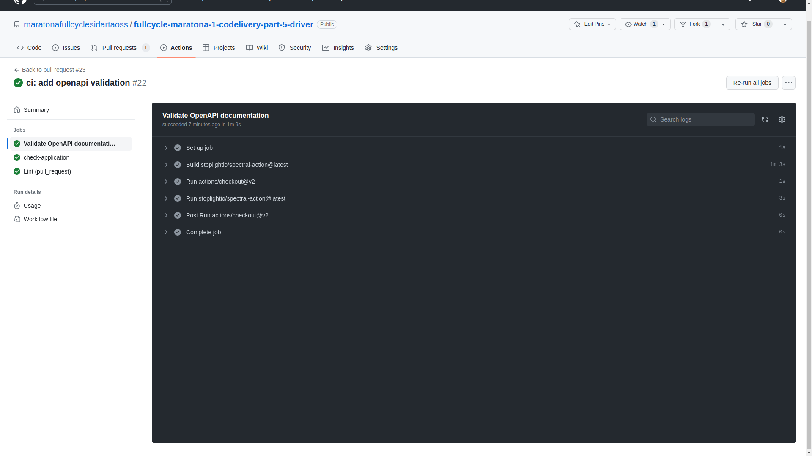

No entanto, se, por exemplo, removemos a descrição da operação _GET_ (_ListDrivers_) no arquivo _swagger.yaml_, a validação não passa:

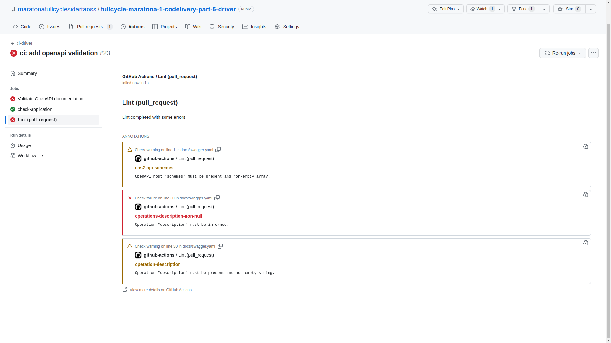

Por fim, não devemos esquecer de ajustar as configurações em _Settings / Branches / Branch protection rules/ Edit develop_ e adicionar na opção de _Require status checks to pass before merging_ o _status check_ de _Validate OpenAPI documentation_.

### Terraform

Antes de iniciarmos o processo de _Continuous Delivery_, precisamos criar um _cluster_ _Kubernetes_. Lembrando que, neste projeto, iremos trabalhar com o _Google Kubernetes Engine_ (_GKE)_.

Mas, desta vez, não iremos criar o _cluster_ partir do painel do _GCP_ (_Google Cloud Platform_); iremos provisionar via _Infrastructure As Code_ (_IaC_), utilizando o _Terraform_.

Aqui, cabe uma breve introdução sobre o _Terraform_.

O _Terraform_ é uma ferramenta _open source_ e foi criado pela _[HashiCorp](https://www.hashicorp.com/)_, empresa focada em desenvolver ferramentas de infraestrutura em nuvem.

O que o _Terraform_ faz de melhor é provisionar infraestrutura. Ou seja, fazer com que _todos_ os componentes de infraestrutura sejam criados em um _cloud provider_. Componentes, neste caso, se referem, principalmente, a objetos de mais baixo nível. Por exemplo, para criar uma máquina em um _cloud provider_, é necessário, antes, criar uma _VPC_, um _Security Group_, _Subnets_, _Internet Gateway_, etc., ou seja, há diversos componentes envolvidos no processo de criação para que se possa atender às configurações que atendam às normas e regras estabelecidas, inclusive de segurança.

Além disso, ele não é uma ferramenta que foi criada para apenas um _cloud provider_; o _Terraform_ trabalha com diversos _providers_. E o que são _providers_? _Providers_ significa uma camada de abstração que torna possível conectar-se com diversos tipos de _cloud_ ou serviços, como, inclusive, o _Kubernetes_.

Seguindo o tutorial do _Terraform_ para provisionar um _cluster GKE_:

- Um dos pré-requisitos é termos o _gcloud_ instalado na máquina local;
- Vamos rodar o comando: `gcloud init` para setar o `gcloud` com algumas configurações padrões, como projeto, zona e região;

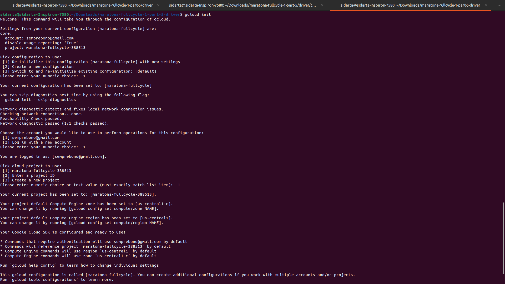

Em seguida, vamos rodar o comando: `gcloud auth application-default login` para autenticar com a _CLI gcloud_. Isso permitirá que o _Terraform_ acesse as credenciais para provisionar recursos na _Google Cloud_.

Na seqüência, vamos clonar uma configuração de exemplo para a pasta _/terraform_:

```
mkdir terraform
cd terraform/

git clone https://github.com/hashicorp/learn-terraform-provision-gke-cluster
```

Devemos atualizar o arquivo _terraform.tfvars_ com _project_id_ e _region_:

```
# Copyright (c) HashiCorp, Inc.
# SPDX-License-Identifier: MPL-2.0

project_id = "maratona-fullcycle-388513"
region     = "us-central1"
```

Vamos alterar também o arquivo _gke.tf_ em _gke_num_nodes_ de 2 para 1. Isso porque um _pool_ de nós será provisionado em cada uma das três zonas da região para fornecer alta disponibilidade, totalizando 3 nós no _cluster_.

```
variable "gke_num_nodes" {
  default     = 1
  description = "number of gke nodes"
}
```

Neste momento, podemos inicializar o _workspace_ do _Terraform_, que irá baixar e inicializar o provedor do _Google Cloud_ com os valores informados em _terraform.tfvars_:

```
terraform init
```

Depois, dentro do diretório inicializado, rodamos o comando `terraform apply` e revisamos as ações planejadas. A saída no _terminal_ indicará que o plano está em execução e quais os recursos que serão criados: uma _VPC_, uma _subnet_, o _cluster GKE_ e um _pool_ de nós do _GKE_.


Após confirmar, o processo de provisionamento pode durar cerca de 10 minutos. Ao final, o _terminal_ irá mostrar os valores definidos para o nome e o _host_ do _cluster_ _GKE_:

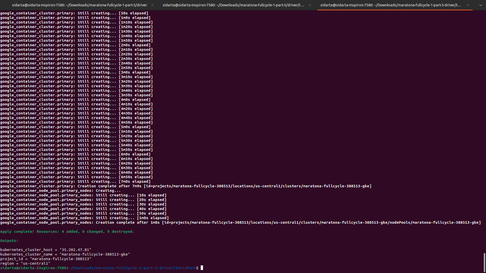

Por fim, devemos rodar um comando para configurar o _kubectl_ com credenciais de acesso:

```
gcloud container clusters get-credentials $(terraform output -raw kubernetes_cluster_name) --region $(terraform output -raw region)
```

E, para confirmar a criação dos nós, é só rodar:

```
kubectl get nodes

NAME                                                  STATUS   ROLES    AGE     VERSION
gke-maratona-fullcyc-maratona-fullcyc-12d4c0b5-2j7d   Ready    <none>   4m49s   v1.25.8-gke.500
gke-maratona-fullcyc-maratona-fullcyc-7a340d65-wkbg   Ready    <none>   4m51s   v1.25.8-gke.500
gke-maratona-fullcyc-maratona-fullcyc-f97e39ff-dvzw   Ready    <none>   4m51s   v1.25.8-gke.500
```

### GitOps

E, agora que provisonamos um _cluster_ _Kubernetes_, podemos iniciar o processo de _Continuous Delivery_, seguindo o modelo de _GitOps_.

O que vem a ser o _GitOps_?

Segundo o _site_ da _[Atlassian](https://www.atlassian.com/br/git/tutorials/gitops)_:

> Em sua essência, o _GitOps_ é uma infraestrutura e um conjunto de procedimentos operacionais com base em código que dependem do _Git_ como um sistema de controle de origem. É uma evolução da Infraestrutura como Código (_IaC_) e uma prática recomendada de _DevOps_ que aproveita o _Git_ como a única fonte de informações e o mecanismo de controle para criar, atualizar e excluir a arquitetura do sistema. Simplificando: é a prática de usar _pull requests_ do _Git_ para verificar e implementar automaticamente modificações na infraestrutura do sistema.

Mas, qual é o problema que o _GitOps_ resolve?

O _GitOps_ trata, principalmente, dessa questão:

- Como garantir que o que está rodando no _cluster Kubernetes_ é o mesmo que está no repositório _Git_? Ou: como garantir que o que está no _branch master_ é exatamente o que está rodando em Produção?

Normalmente, não há como garantir: infere-se que seja a mesma coisa. Mas, se algo acontecer de diferente, como um problema no fluxo de _CI_ ou de _CD_, não há como ter a certeza de que o que está no _branch master_ é, realmente, o que está rodando em Produção.

Isso pode gerar alguns problemas, como:

- Não ter a garantia de que o que foi aplicado em Produção vai conter as últimas funcionalidades que subiram no repositório _Git_.
- Gerar uma dependência forte da ferramenta de _CI_.

Nesse caso, o _Git_ desempenha um papel menos relevante no processo; ele não é o protagonista, é apenas um lugar aonde se guarda o código. E, por conseguinte, o que estiver rodando no _cluster Kubernetes_ não necessariamente vai ter correlação com o que estiver no repositório _Git_.

Então, como tornar esse processo mais integrado, de forma que possamos ter essa garantia de que o que estiver rodando no _cluster_ seja, realmente, a última versão do que foi armazenado no repositório _Git_?

É nesse sentido que o _GitOps_ vem para nos auxiliar, permitindo que o processo de _deploy_ não fique isolado dos demais processos de _commit_, _CI_ e _CD_; ou seja, permite que o _deploy no Kubernetes_ esteja integrado com os demais processos, fazendo parte, então, de um processo único.

#### Como o GitOps funciona

O _GitOps_ parte do princípio, mas também permite tirar proveito, da pré-condição de que estamos trabalhando com sistemas declarativos, ou seja, o provisionamento da infraestrutura é feito, principalmente, a partir de ferramentas de Infraestrutura como Código (_IaC_), como o _Terraform_, assim como a partir de manifestos declarativos para se trabalhar com o _Kubernetes_, por exemplo.

No _GitOps_, o repositório _Git_ é o protagonista do processo, porque ele torna-se a fonte única da verdade.

Logo, como fazer essa integração de o que está no repositório _Git_ com o que está no _cluster Kubernetes_?

A partir de um Agente, também conhecido como _GitOps Operator_.

Então, assim como no processo tradicional, a aplicação fará um _push_ para o repositório _Git_ e será disparado o processo de _CI_ e _CD_. Só que, no processo de _CD_, não será feita a aplicação do manifesto diretamente no _cluster Kubernetes_, será feito apenas um _commit_, a partir do qual será gerada a nova versão da aplicação de forma declarativa.

Assim, o processo de _CD_ não irá mais conversar conversar com o _cluster_, como no processo tradicional. Quando o processo de _CD_ der um _commit_, esse _commit_ será feito no repositório _Git_, aonde será declarado em um manifesto a nova versão de Produção.

Por conseqüência, o Agente, de tempos em tempos, vai ficar monitorando o repositório _Git_ para saber qual é a nova versão de Produção. Então, assim que o Agente souber da nova versão do repositório _Git_, ele irá aplicar no _cluster Kubernetes_ essa mudança.

Por conta disso, a partir desse momento, o repositório _Git_ torna-se a fonte única da verdade, de forma que o que está rodando no _cluster Kubernetes_ é o mesmo que está no repositório _Git_.

#### Criando imagem Docker

Neste momento, vamos refatorar o arquivo _Dockerfile_, porque ele será utilizado no processo de _GitOps_.

Então, vamos remover o arquivo _Dockerfile.prod_ e substituir o conteúdo no arquivo _Dockerfile_ por:

```
FROM golang:1.19 AS build

WORKDIR /app

COPY . .

RUN CGO_ENABLED=0 GOOS=linux GOARCH=amd64 go build driver.go

FROM scratch
WORKDIR /app
COPY --from=build /app/driver  /app/.env /app/drivers.json ./

ENTRYPOINT [ "./driver" ]
```

Em seguida, para testar o _Dockerfile_, vamos criar uma imagem.

```
docker build -t sidartasilva/fullcycle-maratona-1-codelivery-part-5-driver .
```

Vamos verificar, também, se está tudo funcionando a partir do _container_:

```
docker run --rm -p 8081:8081 sidartasilva/fullcycle-maratona-1-codelivery-part-5-driver

2023/06/02 18:20:58 alive
```

E, por fim, vamos subir essa imagem para o _DockerHub_:

```
docker push sidartasilva/fullcycle-maratona-1-codelivery-part-5-driver
```

#### Criando fluxo de geração da imagem

A idéia, neste momento, é criar um _pipeline_ de _CI_ para baixar o projeto , fazer o _build_ e subir a imagem no _DockerHub_. E, para criar o _pipeline_, iremos utilizar o _GitHub Actions_.

O _workflow_ será disparado toda vez que for feito um _PR_ para o _branch_ _master_. Como estamos utilizando a metologia de _GitFlow_, isso irá acontecer toda vez que for gerada uma nova _release_.

```
name: cd-driver
on:
  pull_request:
    branches:
      - master
```

O _job_ irá executar uma tarefa chamada de _Build_ a partir de uma máquina _ubuntu_ que o _GitHub Actions_ irá preparar:

```
name: cd-driver
on:
  pull_request:
    branches:
      - master
jobs:
  build:
    name: Build
    runs-on: ubuntu-latest
```

O nosso primeiro passo será o de _checkout_ do código, ou seja, obter o código que está no repositório e baixar para a máquina _ubuntu_:

```
name: cd-driver
on:
  pull_request:
    branches:
      - master
jobs:
  build:
    name: Build
    runs-on: ubuntu-latest

    steps:
      - name: Checkout code
        uses: actions/checkout@v2
```

Agora que o _GitHub Actions_ baixou o código, nós vamos fazer o _build_ da imagem e subir para o _DockerHub_.

```
name: cd-driver
on:
  pull_request:
    branches:
      - master
jobs:
  build:
    name: Build
    runs-on: ubuntu-latest

    steps:
      - name: Checkout code
        uses: actions/checkout@v2

      - name: Build and push image to DockerHub
        uses: docker/build-push-action@v1.1.0
        with:
          username: ${{ secrets.DOCKER_USERNAME }}
          password: ${{ secrets.DOCKER_PASSWORD }}
          repository: ${{ secrets.DOCKER_USERNAME }}/fullcycle-maratona-1-codelivery-part-5-driver
          tags: ${{ github.sha }}, latest
```

O _sha_ refere-se ao código _hash_ que é gerado como um _ID_ de cada _commit_ e será utilizada como valor para a _tag_ para o controle de versões da imagem.

Neste momento, iremos subir as alterações para o _GitHub_:

```
git add .

git commit -m "ci: add build"

git push origin feature/gitops
```

E, na seqüência, iremos gerar uma nova _release_:

```
git checkout -b release/v1.0.0

git push origin release/v1.0.0
```

> Não devemos esquecer de marcar a opção de _Require a pull request before merging_ nas configurações do _GitHub_ para o _branch_ _master_ (_Settings / Branches / Branch protection rules / Edit master_) e adicionar _Build_ à opção de _Require status checks to pass before merging_.

No _GitHub_, verificamos que o _job_ de _Build_ foi executado com sucesso:

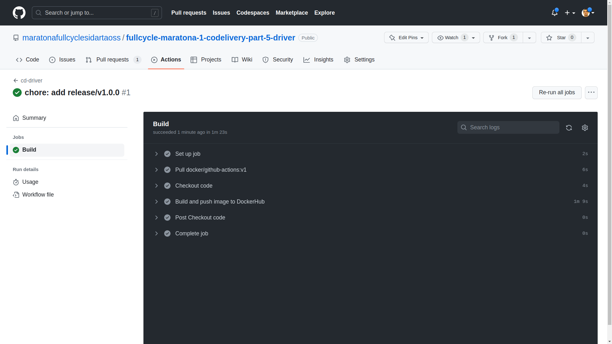

Ao acessar o _DockerHub_, verificamos que foi gerado uma nova imagem com a _tag_ _17a00e083ef145fe6a952e50b6317875bfe18ea5_:

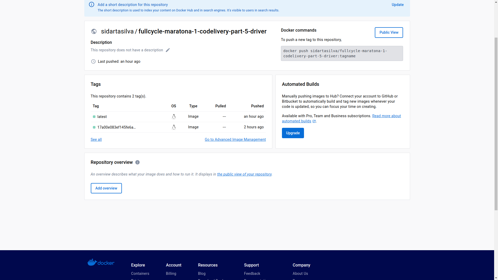

Agora, vamos gerar, localmente, uma _tag_ para a _release/v1.0.0_ e subir para o _GitHub_:

```
git tag -a v1.0.0 -m "version 1.0.0"

git push -u origin v1.0.0
```

Dessa forma, podemos manter o controle das _releases_ que já foram geradas:

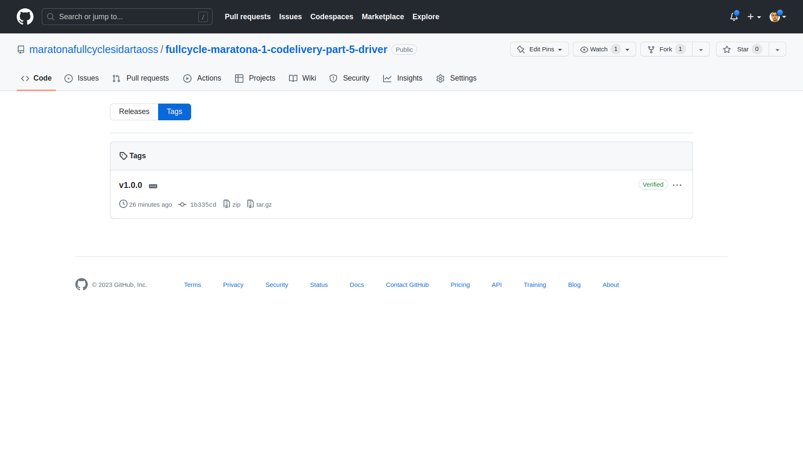

#### Criando manifesto Kubernetes

O manifesto do _Kubernetes_ para a nossa aplicação já foi definido e encontra-se no diretório \_k8s/.

A única alteração que faremos é renomear o nome da imagem no objeto _deployment_ para _driver_:

```
apiVersion: apps/v1
kind: Deployment
metadata:
  name: driver
spec:
  selector:
    matchLabels:
      app: driver
  template:
    metadata:
      labels:
        app: driver
    spec:
      containers:
        - name: driver
          image: driver
          ports:
            - containerPort: 8081
```

E por que definir o nome da imagem como _driver_ se não é esse o nome da imagem que será baixada do _DockerHub_? Porque o nome da imagem será alterado toda vez que rodar o processo de _CD_, utilizando-se uma ferramenta do próprio _Kubernetes_ conhecida como _Kustomize_.

#### Kustomize

Toda vez que alterarmos a versão da imagem, o agente vai ter que conseguir reaplicar o manifesto _Kubernetes_. Mas, para reaplicar, o manifesto vai ter que estar com a versão correta, ou seja, a última versão que corresponda ao _branch_ master no repositório do _GitHub_.

Então, como atualizar a versão da imagem no manifesto?

Para isso, existem algumas possibilidades, como trabalhar com _Helm_, alterando o pacote do _Helm_, ou trabalhar com uma ferramenta do _Kubernetes_ chamada de _Kustomize_ (https://kustomize.io/).

A idéia do _Kustomize_ é criar um arquivo junto aos manifestos, por exemplo, _kustomization.yaml_, aonde se definem os _resources_, ou seja, os manifestos que a ferramenta vai ler e, em seguida, o nome da imagem que se quer customizar, junto com o novo nome e a nova _tag_ para os quais se quer mudar.

```
apiVersion: kustomize.config.k8s.io/v1beta1
kind: Kustomization

resources:
  - driver.yaml

images:
  - name: driver
    newName: sidartasilva/fullcycle-maratona-1-codelivery-part-5-driver
    newTag: newtag
```

Ou seja, quando o _Kustomize_ rodar, ele vai obter a imagem no arquivo _driver.yaml_ e vai customizá-la conforme definido no manifesto do _Kustomize_ que, neste caso, é o _kustomization.yaml_.

O nosso objetivo, ao final, é, no processo de _CD_, alterar o valor de _newTag_ em _kustomization.yaml_ pelo _SHA_ do _GitHub_ e comitar no próprio repositório. Assim, o agente vai ficar monitorando o arquivo do _Kustomize_ e, quando a versão da imagem mudar no arquivo, ele vai sincronizar a versão do repositório no _GitHub_ com a versão no _cluster Kubernetes_.

#### Fluxo de CD

A primeira coisa que faremos, no nosso fluxo de _CD_, é instalar o _Kustomize_:

```
name: cd-driver
on:
  pull_request:
    branches:
      - master
jobs:
  build:
    name: Build
    runs-on: ubuntu-latest

    steps:
      - name: Checkout code
        uses: actions/checkout@v2

      - name: Build and push image to DockerHub
        uses: docker/build-push-action@v1.1.0
        with:
          username: ${{ secrets.DOCKER_USERNAME }}
          password: ${{ secrets.DOCKER_PASSWORD }}
          repository: ${{ secrets.DOCKER_USERNAME }}/fullcycle-maratona-1-codelivery-part-5-driver
          tags: ${{ github.sha }}, latest

      - name: Setup Kustomize
        uses: imranismail/setup-kustomize@v1
        with:
          kustomize-version: "3.6.1"
```

Agora que o _Kustomize_ está instalado, vamos alterar o valor da propriedade _newTag_ no arquivo _kustomization.yaml_:

```
name: cd-driver
on:
  pull_request:
    branches:
      - master
jobs:
  build:
    name: Build
    runs-on: ubuntu-latest

    steps:
      - name: Checkout code
        uses: actions/checkout@v2

      - name: Build and push image to DockerHub
        uses: docker/build-push-action@v1.1.0
        with:
          username: ${{ secrets.DOCKER_USERNAME }}
          password: ${{ secrets.DOCKER_PASSWORD }}
          repository: ${{ secrets.DOCKER_USERNAME }}/fullcycle-maratona-1-codelivery-part-5-driver
          tags: ${{ github.sha }}, latest

      - name: Setup Kustomize
        uses: imranismail/setup-kustomize@v1
        with:
          kustomize-version: "3.6.1"

      - name: Update Kubernetes resources
        env:
          DOCKER_USERNAME: ${{ secrets.DOCKER_USERNAME }}
        run: |
          cd k8s
          kustomize edit set image driver=$DOCKER_USERNAME/fullcycle-maratona-1-codelivery-part-5-driver:$GITHUB_SHA
```

E, por fim, vamos comitar na máquina _ubuntu_ e fazer o _push_ para o repositório do _GitHub_:

```
name: cd-driver
on:
  pull_request:
    branches:
      - master
jobs:
  build:
    name: Build
    runs-on: ubuntu-latest

    steps:
      - name: Checkout code
        uses: actions/checkout@v2

      - name: Build and push image to DockerHub
        uses: docker/build-push-action@v1.1.0
        with:
          username: ${{ secrets.DOCKER_USERNAME }}
          password: ${{ secrets.DOCKER_PASSWORD }}
          repository: ${{ secrets.DOCKER_USERNAME }}/fullcycle-maratona-1-codelivery-part-5-driver
          tags: ${{ github.sha }}, latest

      - name: Setup Kustomize
        uses: imranismail/setup-kustomize@v1
        with:
          kustomize-version: "3.6.1"

      - name: Update Kubernetes resources
        env:
          DOCKER_USERNAME: ${{ secrets.DOCKER_USERNAME }}
        run: |
          cd k8s
          kustomize edit set image driver=$DOCKER_USERNAME/fullcycle-maratona-1-codelivery-part-5-driver:$GITHUB_SHA

      - name: Commit
        run: |
          git config --local user.email "action@github.com"
          git config --local user.name "GitHub Action"
          git commit -am "Bump docker version"

      - name: Push
        uses: ad-m/github-push-action@master
        with:
          github_token: ${{ secrets.GITHUB_TOKEN }}
          repository: maratonafullcyclesidartaoss/fullcycle-maratona-1-codelivery-part-5-driver
```

E, para verificar se está tudo funcionando, vamos gerar uma nova _release_:

```
git checkout -b release/v1.1.0

git push origin release/v1.1.0
```

> Antes de criar o _PR_ para o _branch_ _master_, pode ser necessário alterar, nas configurações do _GitHub_, o _branch_ padrão de _develop_ para _master_.

Após fazer o _merge_ no _branch master_, verificamos que o último histórico que tivemos foi a _GitHub Actions_ dando um _Bump docker version_ e, se acessarmos o arquivo _k8s/kustomization.yaml_, vemos que a propriedade _newTag_ está com uma nova versão (i.e., _b5acebca98636c6fee8518a4198f1e27a81fcf34_):

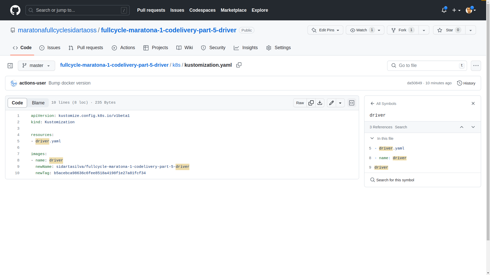

E, se verificarmos no _DockerHub_, vemos que foi adicionada uma nova imagem com a mesma _tag b5acebca98636c6fee8518a4198f1e27a81fcf34_.

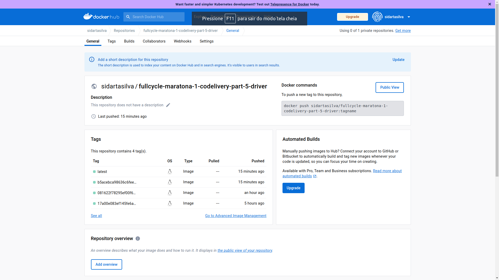

Por final, criamos uma nova _tag_ da _release/v1.1.0_:

```
git tag -a v1.1.0 -m "version 1.1.0"

git push -u origin v1.1.0
```

O nosso objetivo, agora, é, simplesmente, trabalhar com o agente, ou seja, a ferramenta _ArgoCD_ para acessar o repositório do _GitHub_ e atualizar a aplicação no _cluster Kubernetes_ com a última versão desse repositório.

#### ArgoCD

O _ArgoCD_ é uma ferramenta que vai ficar lendo o repositório no _GitHub_ e, se houver alguma mudança, ele vai mostrar para fazer a sincronização no _cluster Kubernetes_.

Como instalar?

Para instalar, basicamente, basta seguir os passos definidos na página de documentação do _ArgoCD_ (https://argo-cd.readthedocs.io/en/stable/getting_started/):

```
kubectl create namespace argocd
kubectl apply -n argocd -f https://raw.githubusercontent.com/argoproj/argo-cd/stable/manifests/install.yaml
```

Ou seja, cria-se um novo _namespace_ e aplica-se o manifesto de instalação diretamente no _cluster Kubernetes_.

Ao rodar o comando `kubectl get all -n argocd`, podemos visualizar todos os objetos que foram criados no _namespace_ _argocd_:


Como fazer o login no _ArgoCD_?

Novamente, conforme a documentação, basta executar o seguinte comando para obter-se uma senha:

```
argocd admin initial-password -n argocd
```

Agora, para rodar o _ArgoCD_, basta executar um comando de _port forwarding_:

```
kubectl port-forward svc/argocd-server -n argocd 8080:443
```

E, para acessar, basta digitar `localhost:8080` no navegador e logar com o _username admin_ e a senha obtida anteriormente:

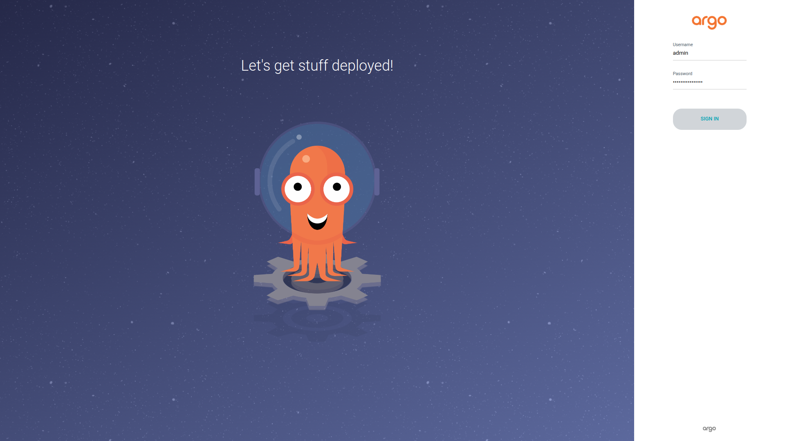

#### Fazendo deploy com ArgoCD

O nosso objetivo, agora, é fazer o deploy da aplicação e fazer também com que o _ArgoCD_ torne-se o agente no processo de _GitOps_, ou seja, ele permanece lendo o repositório no _GitHub_ e, toda vez que houver uma mudança no repositório, ele vai aplicar no _cluster Kubernetes_ também.

Como criar uma nova aplicação no _ArgoCD_?

Isso pode ser feito de duas maneiras: via _IaC_ através de um manifesto ou via painel do _ArgoCD_. Neste caso, iremos criar via painel do _ArgoCD_.

Então, clicamos no botão _New App_ e é aberto um novo formulário:

- Em _Application name_, preenchemos com: _driver_;
- Em Project name, selecionamos _default_, porque se refere ao próprio _cluster Kubernetes_;
- Em SYNC POLICY, vamos deixar como _Manual_, o que significa que o _ArgoCD_ não irá sincronizar automaticamente o _cluster_ a cada alteração do repositório no _GitHub_; será de responsabilidade do desenvolvedor sincronizar manualmente.
- Em SOURCE, preenche-se com o repositório do _GitHub_: _https://github.com/maratonafullcyclesidartaoss/fullcycle-maratona-1-codelivery-part-5-driver_;
- Em Path, selecionamos _k8s_, que o _ArgoCD_ já reconheceu como um diretório contendo manifesto do _Kubernetes_;
- Em DESTINATION/Cluster URL, selecionamos o nosso próprio _cluster_, ou seja, _https://kubernetes.default.svc_;
- Em Namespace, preenchemos com _default_;

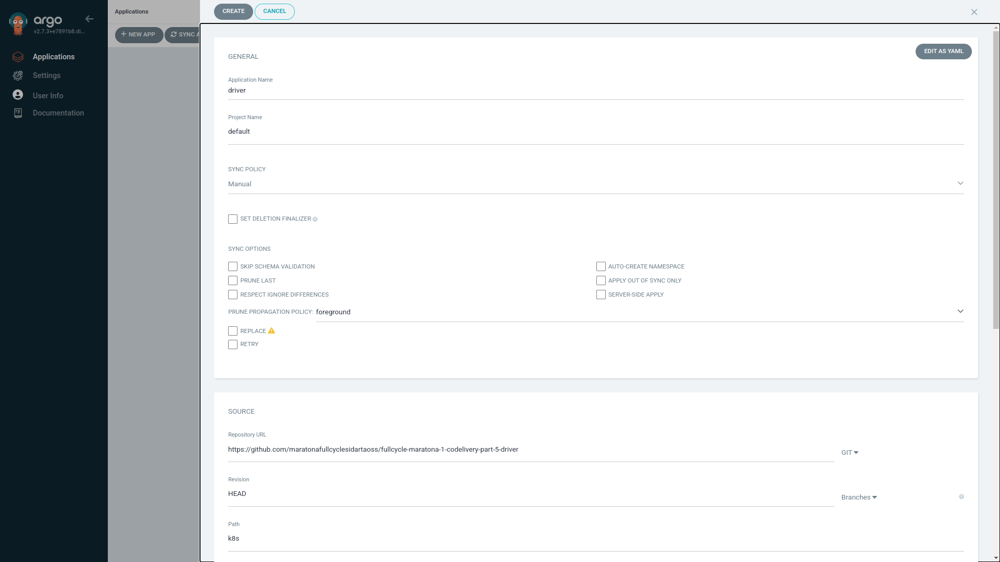

Agora, basta clicar em _Create_:

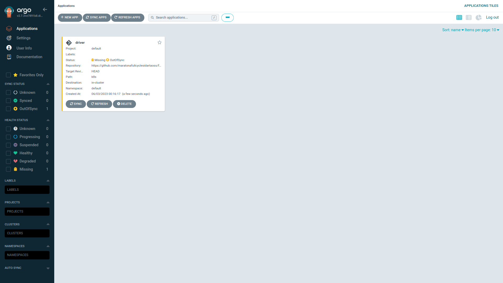

Vemos que o _ArgoCD_ está nos indicando que a aplicação está _OutOfSync_, ou seja, o que está no repositório no _GitHub_ é diferente do que está no _cluster Kubernetes_.

Agora, vamos entrar na aplicação:

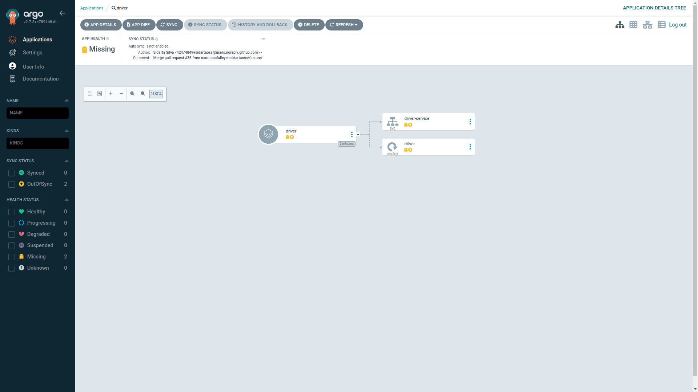

O _ArgoCD_ está nos informando que tanto o objeto de _Deployment_ quanto _Service_ estão faltando (_missing_) no _cluster Kubernetes_.

Então, para sincronizar, nós podemos clicar em _SYNC/SYNCHRONIZE_ e, automaticamente, é feita a sincronização com o cluster Kubernetes: baixa-se a imagem com base nos manifestos no repositório do _GitHub_ e os são criados os objetos de _Deployment_, _ReplicaSet_, _Service_ e _POD_:


Agora, para testar se o serviço está no ar, obtemos o _IP_ externo e fazemos um _curl_ para _/drivers_:

```
kubectl get svc

NAME             TYPE           CLUSTER-IP    EXTERNAL-IP     PORT(S)        AGE
driver-service   LoadBalancer   10.7.241.70   34.173.227.93   80:31139/TCP   9m44s
kubernetes       ClusterIP      10.7.240.1    <none>          443/TCP        9h

curl 34.173.227.93/drivers
{"Drivers":[{"uuid":"45688cd6-7a27-4a7b-89c5-a9b604eefe2f","name":"Wesley W"},{"uuid":"9a118e4d-821a-44c7-accc-fa99ac4be01a","name":"Luiz"}]}
```

Neste momento, vamos gerar mais uma _release_ para ver o comportamento do _ArgoCD_:

```
git checkout -b release/v1.1.1

git push origin release/v1.1.1
```

Ao criar um novo _PR_, podemos ver que rodou o processo de _CD_ e foi alterado o arquivo do _Kustomize_ com a linha da nova versão:

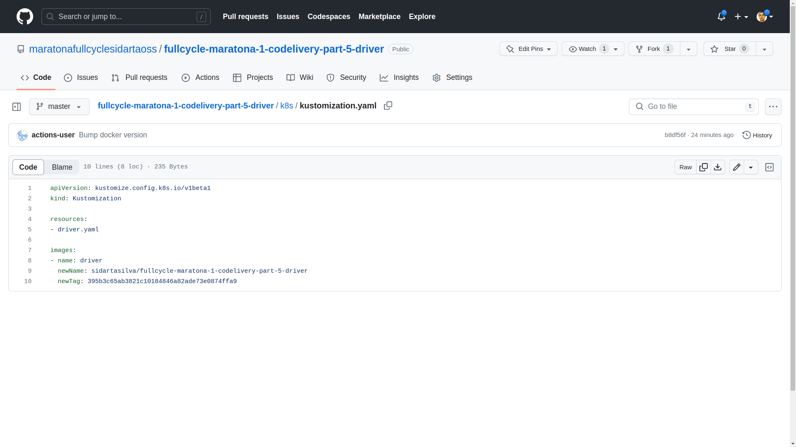

Podemos verificar, também, que foi criada uma imagem com a nova _tag_ no _DockerHub_:

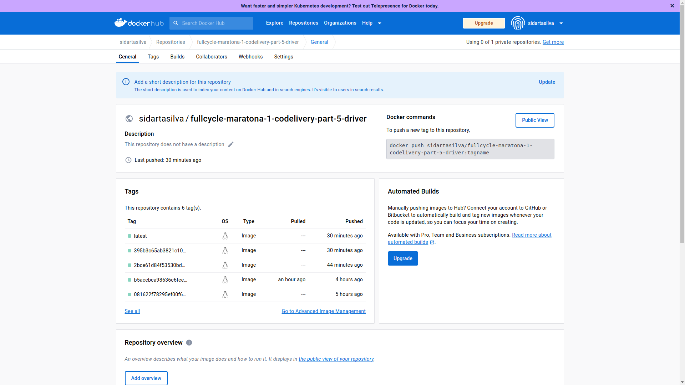

Em suma, o fluxo de _CD_ é responsável por apenas subir uma imagem para o _DockerHub_ e alterar uma linha no arquivo do _Kustomize_; não existe nenhuma relação direta com o _cluster Kubernetes_ no processo de _CD_.

E, neste momento, vamos verificar o _ArgoCD_:

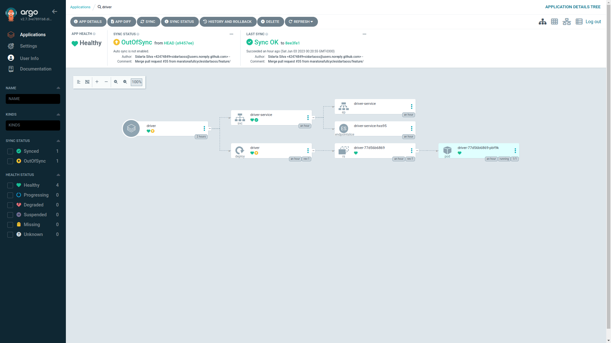

De tempos em tempos, o _ArgoCD_ acessa o repositório no _GitHub_ para verificar se houve alguma alteração e podemos ver que a aplicação está _OutOfSync_. O que nós podemos fazer é clicar em _SYNC_ e _SYNCHRONIZE_ e, em seguida, o _ArgoCD_ sincroniza com o _cluster Kubernets_ e um novo _POD_ é criado.

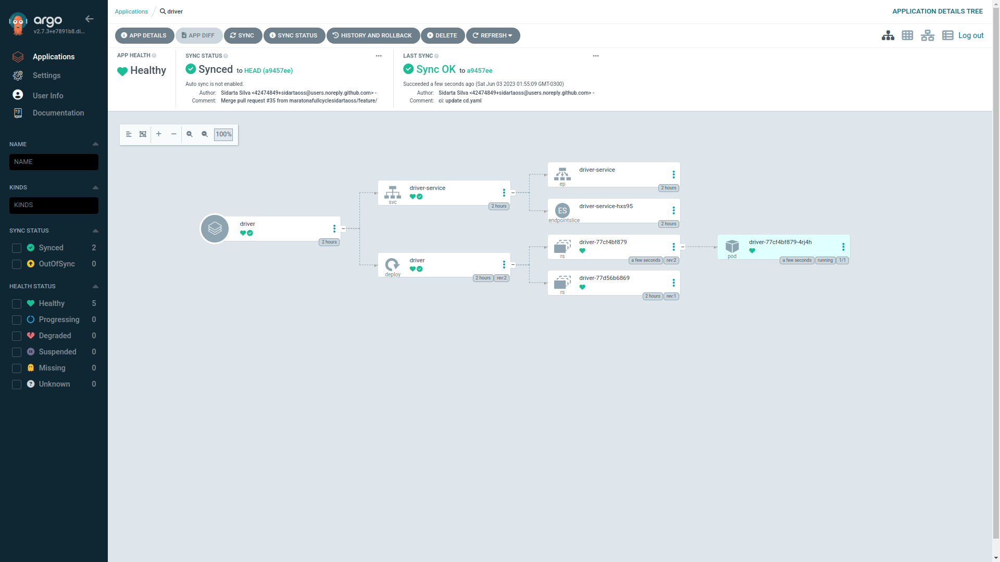

E, se testarmos novamente, o serviço continua respondendo:

```
curl 34.173.227.93/drivers
{"Drivers":[{"uuid":"45688cd6-7a27-4a7b-89c5-a9b604eefe2f","name":"Wesley W"},{"uuid":"9a118e4d-821a-44c7-accc-fa99ac4be01a","name":"Luiz"}]}
```

### Destruindo a infraestrutura

Chegou o momento de liberar os recursos no ambiente _cloud_.

Para tanto, iremos utilizar o _Terraform_, que irá remover todos os recursos relacionados com o _cluster GKE_.

```
cd terraform/

terraform destroy
```

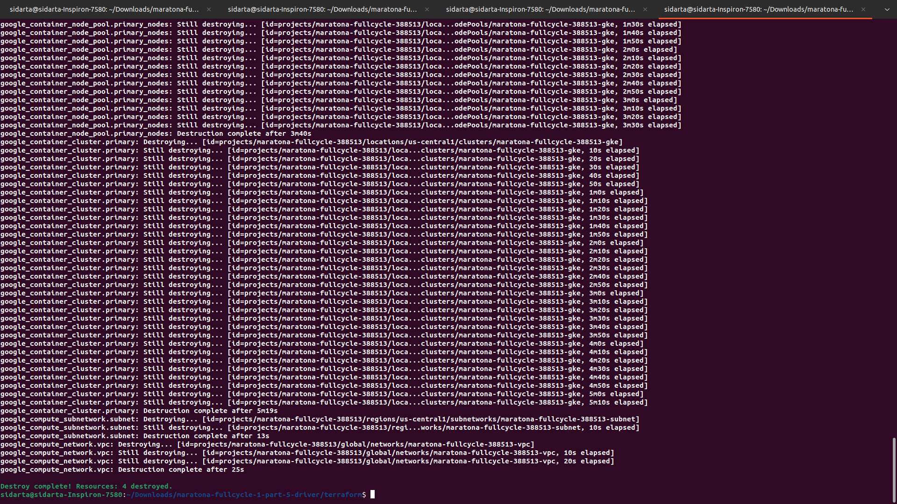

#### Referências

UDEMY. Como implementar GitFlow en Gitlab y Github. 2023. Disponível em: <https://www.udemy.com/course/como-implementar-gitflow-en-gitlab-y-github>. Acesso em: 26 mai. 2023.

FULL CYCLE 3.0. Integração contínua. 2023. Disponível em: <https://plataforma.fullcycle.com.br>. Acesso em: 26 mai. 2023.

FULL CYCLE 3.0. Padrões e técnicas avançadas com Git e Github. 2023. Disponível em: <https://plataforma.fullcycle.com.br>. Acesso em: 26 mai. 2023.

SONARCLOUD. Clean code in your cloud workflow with {SonarCloud}. 2023. Disponível em: <https://www.sonarsource.com/products/sonarcloud>. Acesso em: 26 mai. 2023.

FULL CYCLE 3.0. API Gateway com Kong e Kubernetes. 2023. Disponível em: <https://plataforma.fullcycle.com.br>. Acesso em: 31 mai. 2023.

SPECTRAL. Create a Ruleset. 2023. Disponível em: <https://meta.stoplight.io/docs/spectral/01baf06bdd05a-create-a-ruleset>. Acesso em: 01 jun. 2023.

TERRAFORM. Provision a GKE Cluster (Google Cloud). 2023. Disponível em: <https://developer.hashicorp.com/terraform/tutorials/kubernetes/gke>. Acesso em: 01 jun. 2023.

FULL CYCLE 3.0. GitOps. 2023. Disponível em: <https://plataforma.fullcycle.com.br>. Acesso em: 02 jun. 2023.

ARGO CD. Getting Started. 2023. Disponível em: <https://argo-cd.readthedocs.io/en/stable/getting_started>. Acesso em: 02 jun. 2023.

FULL CYCLE 3.0. Terraform. 2023. Disponível em: <https://plataforma.fullcycle.com.br>. Acesso em: 04 jun. 2023.

KUBERNETES DOCUMENTATION. Declarative Management of Kubernetes Objects Using Kustomize. 2023. Disponível em: <https://kubernetes.io/docs/tasks/manage-kubernetes-objects/kustomization>. Acesso em: 04 jun. 2023.
